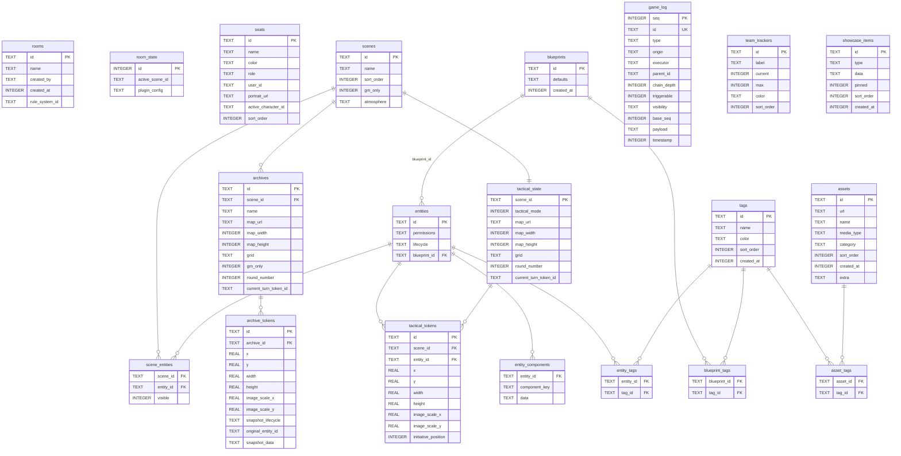

# 数据模型

## 存储架构

- **全局库** `data/global.db`：仅 `rooms` 表（1 张）
- **房间库** `data/rooms/{roomId}/room.db`：19 张表，完全隔离

所有 SQLite 连接启用 WAL 模式 + `foreign_keys = ON`。

## Schema 总览

```
rooms (全局)
  └── room.db (per-room)
       ├── room_state (singleton)
       ├── seats
       ├── scenes
       │    ├── scene_entities (M2M → entities)
       │    ├── archives
       │    │    └── archive_tokens
       │    └── tactical_state
       │         └── tactical_tokens (→ entities)
       ├── blueprints
       │    └── blueprint_tags (→ tags)
       ├── entities
       │    ├── entity_components (ECS key/value)
       │    └── entity_tags (→ tags)
       ├── tags
       ├── assets
       │    └── asset_tags (→ tags)
       ├── game_log
       ├── team_trackers
       └── showcase_items
```

## ECS 架构：entities + entity_components

实体采用 Entity-Component-System (ECS) 模式。`entities` 表只保留核心元数据（权限、生命周期、蓝图引用），所有可变的身份/外观/规则数据通过 `entity_components` 以 key-value 方式存储。

```
entities (slim metadata)          entity_components (dynamic data)
┌────────────────────────┐       ┌─────────────────────────────────┐
│ id          TEXT PK    │  1:N  │ entity_id  TEXT FK (CASCADE)    │
│ permissions TEXT(JSON)  │──────→│ component_key TEXT              │
│ lifecycle   TEXT        │       │ data        TEXT(JSON)          │
│ blueprint_id TEXT FK    │       │ PK(entity_id, component_key)   │
└────────────────────────┘       └─────────────────────────────────┘
```

**优势**：插件可自由注册新 component_key 而无需迁移 schema；前端按需加载特定 component；蓝图的 `defaults.components` 直接映射为 entity_components 行。

## ER 关系图



## 表定义

### rooms（全局库）

| 列             | 类型    | 说明                          |
| -------------- | ------- | ----------------------------- |
| id             | TEXT PK | 房间 ID                       |
| name           | TEXT    | 房间名                        |
| created_by     | TEXT    | 创建者                        |
| created_at     | INTEGER | 时间戳                        |
| rule_system_id | TEXT    | 规则系统 ID（默认 'generic'） |

### room_state（单例行，id=1）

| 列              | 类型       | 说明         |
| --------------- | ---------- | ------------ |
| active_scene_id | TEXT       | 当前活动场景 |
| plugin_config   | TEXT(JSON) | 插件配置     |

### seats

| 列                  | 类型    | 说明                    |
| ------------------- | ------- | ----------------------- |
| id                  | TEXT PK | 座位 ID                 |
| name                | TEXT    | 显示名                  |
| color               | TEXT    | 主题色                  |
| role                | TEXT    | 'GM' 或 'PL'            |
| user_id             | TEXT    | 用户 ID（预留，未使用） |
| portrait_url        | TEXT    | 头像                    |
| active_character_id | TEXT    | 当前操控角色            |
| sort_order          | INTEGER | 排序                    |

### scenes

| 列         | 类型       | 说明               |
| ---------- | ---------- | ------------------ |
| id         | TEXT PK    | 场景 ID            |
| name       | TEXT       | 场景名             |
| sort_order | INTEGER    | 排序               |
| gm_only    | INTEGER    | GM 专属场景        |
| atmosphere | TEXT(JSON) | 氛围配置（见下方） |

**atmosphere JSON 结构**：

```json
{
  "imageUrl": "string",
  "width": 1920,
  "height": 1080,
  "particlePreset": "none|embers|snow|dust|rain|fireflies",
  "ambientPreset": "string",
  "ambientAudioUrl": "string",
  "ambientAudioVolume": 0.5
}
```

### blueprints（实体模板工厂）

| 列         | 类型       | 说明                                       |
| ---------- | ---------- | ------------------------------------------ |
| id         | TEXT PK    | 蓝图 ID                                    |
| defaults   | TEXT(JSON) | 默认组件集（结构：`{"components":{...}}`） |
| created_at | INTEGER    | 创建时间戳                                 |

从蓝图创建实体时，`defaults.components` 中的每个 key-value 对会写入 `entity_components` 表。

### entities（ECS 元数据行）

| 列           | 类型       | 说明                                    |
| ------------ | ---------- | --------------------------------------- |
| id           | TEXT PK    | 实体 ID                                 |
| permissions  | TEXT(JSON) | 权限配置（见下方）                      |
| lifecycle    | TEXT       | 'ephemeral' / 'reusable' / 'persistent' |
| blueprint_id | TEXT FK    | → blueprints.id（SET NULL on delete）   |

**permissions JSON 结构**：

```json
{
  "default": "none|observer|owner",
  "seats": { "seat-id": "none|observer|owner" }
}
```

**lifecycle 语义**：

- `ephemeral`：一次性 NPC，只存在于创建场景，不污染实体库
- `reusable`：可复用 NPC，可在多个场景间共享
- `persistent`：PC 角色，永久存在

### entity_components（ECS 组件存储）

| 列            | 类型       | 说明                                               |
| ------------- | ---------- | -------------------------------------------------- |
| entity_id     | TEXT FK    | → entities.id（CASCADE）                           |
| component_key | TEXT       | 组件标识符（如 'identity'、'appearance'、'stats'） |
| data          | TEXT(JSON) | 组件数据                                           |

**复合主键**：`(entity_id, component_key)` — 每个实体的每个组件类型最多一行。

常见 component_key 示例：

- `identity`：名称、笔记等身份信息
- `appearance`：图片 URL、颜色、尺寸等外观数据
- `rule_data`：由规则插件定义的数据（HP、AC 等）

### scene_entities（M2M 关联表）

| 列        | 类型    | 说明                     |
| --------- | ------- | ------------------------ |
| scene_id  | TEXT FK | → scenes.id（CASCADE）   |
| entity_id | TEXT FK | → entities.id（CASCADE） |
| visible   | INTEGER | 是否上场（0=候场）       |

### tags（一等标签实体）

| 列         | 类型    | 说明                             |
| ---------- | ------- | -------------------------------- |
| id         | TEXT PK | 标签 ID                          |
| name       | TEXT    | 标签名（UNIQUE, COLLATE NOCASE） |
| color      | TEXT    | 标签颜色                         |
| sort_order | INTEGER | 排序                             |
| created_at | INTEGER | 创建时间戳                       |

### asset_tags / entity_tags / blueprint_tags（标签关联表）

三张结构相同的 junction table，分别关联 assets、entities、blueprints 到 tags。

| 列                                  | 类型    | 说明                     |
| ----------------------------------- | ------- | ------------------------ |
| asset_id / entity_id / blueprint_id | TEXT FK | → 对应主表.id（CASCADE） |
| tag_id                              | TEXT FK | → tags.id（CASCADE）     |

每张表均以 `(主体_id, tag_id)` 为复合主键。

### archives

| 列                    | 类型       | 说明                   |
| --------------------- | ---------- | ---------------------- |
| id                    | TEXT PK    | 存档 ID                |
| scene_id              | TEXT FK    | → scenes.id（CASCADE） |
| name                  | TEXT       | 存档名                 |
| map_url               | TEXT       | 战术地图 URL           |
| map_width             | INTEGER    | 地图宽度               |
| map_height            | INTEGER    | 地图高度               |
| grid                  | TEXT(JSON) | 网格配置               |
| gm_only               | INTEGER    | GM 专属                |
| round_number          | INTEGER    | 存档时的回合数         |
| current_turn_token_id | TEXT       | 存档时的当前回合 Token |

### archive_tokens

| 列                           | 类型       | 说明                     |
| ---------------------------- | ---------- | ------------------------ |
| id                           | TEXT PK    | Token ID                 |
| archive_id                   | TEXT FK    | → archives.id（CASCADE） |
| x, y                         | REAL       | 位置                     |
| width, height                | REAL       | 尺寸                     |
| image_scale_x, image_scale_y | REAL       | 图像缩放                 |
| snapshot_lifecycle           | TEXT       | 快照时的 lifecycle       |
| original_entity_id           | TEXT       | 原始实体引用             |
| snapshot_data                | TEXT(JSON) | 实体快照（ephemeral 用） |

**快照策略**：

- `ephemeral` 实体 → `snapshot_data` 包含完整 JSON 快照，`original_entity_id` 可能为 null
- `reusable`/`persistent` 实体 → `snapshot_data = null`，通过 `original_entity_id` 引用现有实体

### tactical_state（per-scene）

| 列                    | 类型       | 说明                   |
| --------------------- | ---------- | ---------------------- |
| scene_id              | TEXT PK FK | → scenes.id（CASCADE） |
| tactical_mode         | INTEGER    | 战术模式开关           |
| map_url               | TEXT       | 战术地图 URL           |
| map_width, map_height | INTEGER    | 地图尺寸               |
| grid                  | TEXT(JSON) | 网格配置               |
| round_number          | INTEGER    | 当前回合数             |
| current_turn_token_id | TEXT       | 当前回合 Token（预留） |

### tactical_tokens

| 列                           | 类型    | 说明                                 |
| ---------------------------- | ------- | ------------------------------------ |
| id                           | TEXT PK | Token ID                             |
| scene_id                     | TEXT FK | → tactical_state.scene_id（CASCADE） |
| entity_id                    | TEXT FK | → entities.id（CASCADE）             |
| x, y                         | REAL    | 位置                                 |
| width, height                | REAL    | 尺寸                                 |
| image_scale_x, image_scale_y | REAL    | 图像缩放                             |
| initiative_position          | INTEGER | 先攻位置（预留，未接线）             |

**约束**：`UNIQUE(scene_id, entity_id)` — 同一实体在同一场景只能有一个 Token。

### assets

| 列         | 类型       | 说明                            |
| ---------- | ---------- | ------------------------------- |
| id         | TEXT PK    | 素材 ID                         |
| url        | TEXT       | 文件 URL                        |
| name       | TEXT       | 显示名                          |
| media_type | TEXT       | 媒体类型（'image' / 'handout'） |
| category   | TEXT       | 用途分类（'map' / 'token'）     |
| sort_order | INTEGER    | 排序                            |
| created_at | INTEGER    | 时间戳                          |
| extra      | TEXT(JSON) | 额外数据（handout 的内容等）    |

标签通过 `asset_tags` junction table 关联，不再内嵌 JSON。

### game_log（统一事件流）

| 列          | 类型       | 说明                                     |
| ----------- | ---------- | ---------------------------------------- |
| seq         | INTEGER PK | 自增序列号（AUTOINCREMENT）              |
| id          | TEXT UK    | 客户端生成的唯一 ID（UNIQUE）            |
| type        | TEXT       | 事件类型（如 'chat'、'roll'、'system'）  |
| origin      | TEXT       | 消息来源（seat ID 或 system identifier） |
| executor    | TEXT       | 执行者 seat ID                           |
| parent_id   | TEXT       | 父事件 ID（用于事件链）                  |
| chain_depth | INTEGER    | 事件链深度                               |
| triggerable | INTEGER    | 是否可触发后续事件                       |
| visibility  | TEXT(JSON) | 可见性规则（见下方）                     |
| base_seq    | INTEGER    | 客户端基准 seq（乐观并发控制）           |
| payload     | TEXT(JSON) | 事件数据载荷                             |
| timestamp   | INTEGER    | 时间戳                                   |

**双 ID 设计**：`seq` 用于排序和分页查询（单调递增），`id` 用于幂等去重和事件链引用。

**visibility JSON 结构**：

```json
{}                        // 空对象 = 公开
{ "include": ["seat-1"] } // 白名单模式
{ "exclude": ["seat-2"] } // 黑名单模式
```

### team_trackers

| 列         | 类型    | 说明      |
| ---------- | ------- | --------- |
| id         | TEXT PK | 追踪器 ID |
| label      | TEXT    | 标签      |
| current    | INTEGER | 当前值    |
| max        | INTEGER | 最大值    |
| color      | TEXT    | 颜色      |
| sort_order | INTEGER | 排序      |

### showcase_items

| 列         | 类型       | 说明      |
| ---------- | ---------- | --------- |
| id         | TEXT PK    | 展示项 ID |
| type       | TEXT       | 'image'   |
| data       | TEXT(JSON) | 展示数据  |
| pinned     | INTEGER    | 是否置顶  |
| sort_order | INTEGER    | 排序      |
| created_at | INTEGER    | 时间戳    |

## JSON 字段策略

| 字段          | 表                       | 存储方式  | 理由                               |
| ------------- | ------------------------ | --------- | ---------------------------------- |
| atmosphere    | scenes                   | JSON blob | 字段组合固定，不需要单独查询       |
| grid          | tactical_state, archives | JSON blob | 6 个子字段，不需要索引             |
| permissions   | entities                 | JSON blob | 结构灵活（动态 seat ID）           |
| data          | entity_components        | JSON blob | 组件数据由插件定义，schema 未知    |
| defaults      | blueprints               | JSON blob | 组件模板，结构同 entity_components |
| payload       | game_log                 | JSON blob | 事件载荷因 type 而异，结构不固定   |
| visibility    | game_log                 | JSON blob | 三种模式（公开/白名单/黑名单）     |
| snapshot_data | archive_tokens           | JSON blob | 完整实体快照                       |
| extra, data   | assets, showcase_items   | JSON blob | 灵活扩展字段                       |

## 命名转换约定

- SQLite 列名：`snake_case`（如 `media_type`、`component_key`）
- REST API 响应 + 前端：`camelCase`（如 `mediaType`、`componentKey`）
- 转换工具在 `server/db.ts`：
  - `toCamel(row)` — snake_case → camelCase
  - `parseJsonFields(row, ...fields)` — 解析 JSON 字符串字段
  - `toBoolFields(row, ...fields)` — SQLite 0/1 → boolean

## TypeScript 类型映射

前端类型定义分布在 `src/shared/` 下：

| 类型                | 文件             | 对应表/字段                  |
| ------------------- | ---------------- | ---------------------------- |
| `Entity`            | `entityTypes.ts` | entities + entity_components |
| `MapToken`          | `entityTypes.ts` | tactical_tokens              |
| `Blueprint`         | `entityTypes.ts` | blueprints + blueprint_tags  |
| `Atmosphere`        | `entityTypes.ts` | scenes.atmosphere JSON       |
| `EntityPermissions` | `entityTypes.ts` | entities.permissions JSON    |
| `SceneEntityEntry`  | `entityTypes.ts` | scene_entities               |
| `AssetMeta`         | `assetTypes.ts`  | assets + asset_tags          |
| `TagMeta`           | `assetTypes.ts`  | tags                         |
| `GameLogEntry`      | `logTypes.ts`    | game_log                     |
| `Visibility`        | `logTypes.ts`    | game_log.visibility JSON     |

## 索引

| 索引                         | 表                | 列         |
| ---------------------------- | ----------------- | ---------- |
| idx_game_log_type            | game_log          | type       |
| idx_game_log_executor        | game_log          | executor   |
| idx_game_log_parent          | game_log          | parent_id  |
| idx_scene_entities_scene     | scene_entities    | scene_id   |
| idx_entities_lifecycle       | entities          | lifecycle  |
| idx_tactical_tokens_scene    | tactical_tokens   | scene_id   |
| idx_tactical_tokens_entity   | tactical_tokens   | entity_id  |
| idx_archive_tokens_archive   | archive_tokens    | archive_id |
| idx_blueprints_created       | blueprints        | created_at |
| idx_asset_tags_tag           | asset_tags        | tag_id     |
| idx_blueprint_tags_tag       | blueprint_tags    | tag_id     |
| idx_entity_components_entity | entity_components | entity_id  |
| idx_entity_tags_tag          | entity_tags       | tag_id     |
