# 插件系统演进路线

> **状态**：实施中 | 2026-04-04 更新（DaggerHeart 验收完成 — diceSystem 退役、EventBus 移除、Dispatcher 自愈）
> **前置文档**：`archive/design-history/11-规则插件系统架构设计.md`（已归档）、`15-v2-Workflow系统现状.md`、`16-事件日志与骰子系统架构.md`
> **范围**：插件系统现状分析、终态架构推演、演进路线图、任务评估

---

## 目录

1. [系统架构现状](#1-系统架构现状)
2. [核心系统完成状态](#2-核心系统完成状态)
3. [RulePlugin 消费热力图](#3-ruleplugin-消费热力图)
4. [终态架构](#4-终态架构)
5. [三条演进轨道](#5-三条演进轨道)
6. [关键架构决策](#6-关键架构决策)
7. [近中期任务评估](#7-近中期任务评估)
8. [Sprint 路线图](#8-sprint-路线图)
9. [布局引擎独立性分析](#9-布局引擎独立性分析)
   9b. [Layer 层级编排方案](#9b-layer-层级编排方案b0)
10. [Workflow 三种触发方式](#10-workflow-三种触发方式)
11. [状态触发与能力边界](#11-状态触发与能力边界)
12. [跨客户端协调](#12-跨客户端协调)
13. [Workflow 引擎设计边界](#13-workflow-引擎设计边界)
14. [UI 渲染器 Registry 设计](#14-ui-渲染器-registry-设计)
15. [偏差文档更新](#15-偏差文档更新)

---

## 1 系统架构现状

当前插件系统采用三层架构：Plugin → Engine → Data。

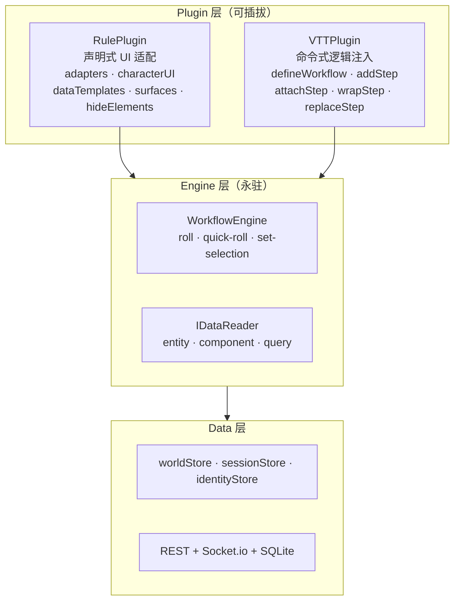

### 插件注册流程

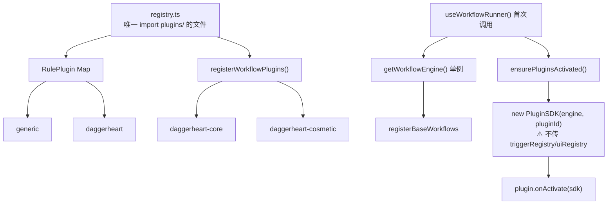

### 四条数据交互通路

| 通路     | 方向                 | 机制                                             | 状态         |
| -------- | -------------------- | ------------------------------------------------ | ------------ |
| ① 读取   | Data → UI            | `sdk.read`（命令式）+ `sdk.data`（响应式 hooks） | ✅           |
| ② 写入   | UI → Workflow → Data | `runner.runWorkflow()`                           | ✅           |
| ③ 拖拽   | UI → DnD → Workflow  | `onDrop → workflow`                              | ✅           |
| ④ 副作用 | Workflow → UI        | `ctx.events.emit → useEvent`                     | ✅（仅本地） |
| ⑤ 输入   | Workflow ↔ UI        | `requestInput` ↔ `registerInputHandler`          | ✅           |

---

## 2 核心系统完成状态

### 2.1 Workflow 系统 — ✅ 生产就绪

所有 Workflow 引擎能力已实现并通过测试（详见 `15-v2-Workflow系统现状.md`）。

### 2.2 事件日志与骰子系统

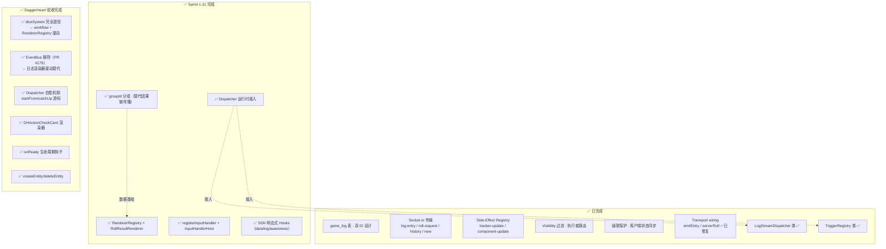

> **2026-04-04 更新**：EventBus 已在 PR #179 中移除，跨客户端效果由日志渲染器驱动（RendererRegistry）替代。diceSystem 接口已完全从 RulePlugin 中删除。

### 2.3 Entity 组件系统 — ✅ 迁移完成

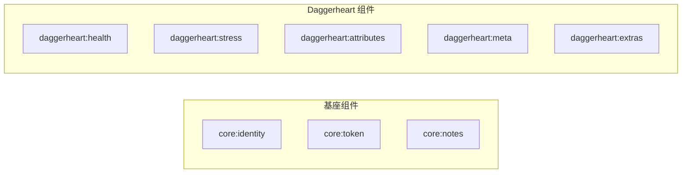

---

## 3 RulePlugin 消费热力图

基座代码中 RulePlugin 的消费点——退役工作量的来源：

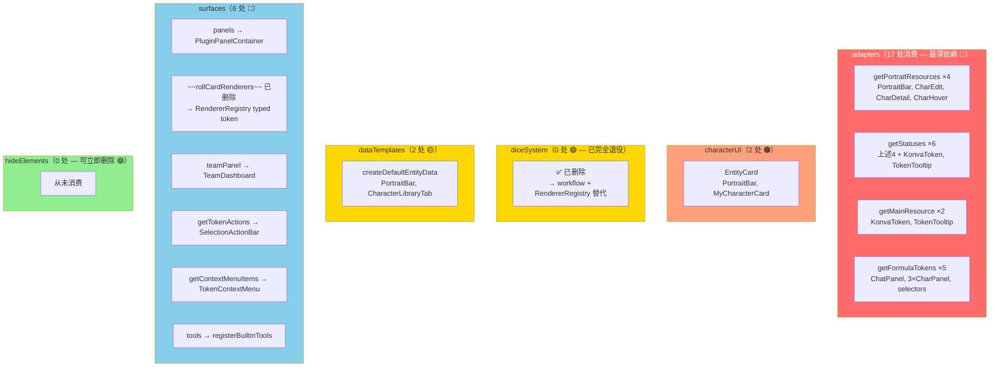

---

## 4 终态架构

### 4.1 终态模型

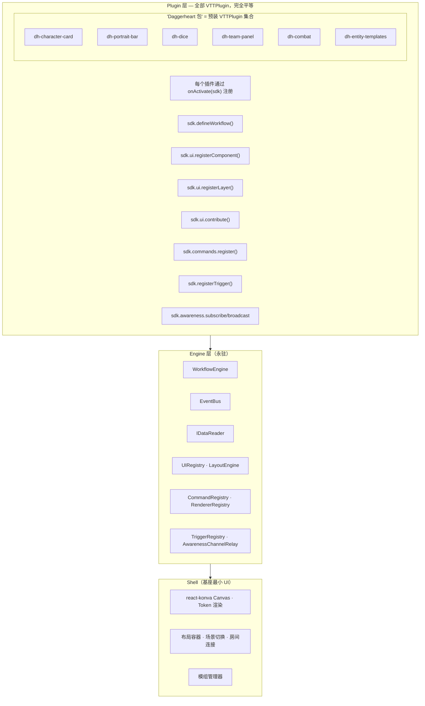

### 4.2 终态 vs 现状

| 维度         | 现状                                    | 终态                                  |
| ------------ | --------------------------------------- | ------------------------------------- |
| 插件类型     | RulePlugin + VTTPlugin                  | 只有 VTTPlugin                        |
| 插件发现     | 硬编码 registry.ts                      | 模组管理器动态加载                    |
| UI 归属      | 基座硬编码                              | 全部插件注册                          |
| 数据适配     | adapter → ResourceView                  | 插件直接读自己的组件                  |
| 骰子系统     | ~~RulePlugin.diceSystem~~ ✅ 已完全退役 | workflow + command + RendererRegistry |
| 跨客户端效果 | ~~EventBus~~ ✅ 已移除（PR #179）       | 日志渲染器驱动（RendererRegistry）    |
| 实时感知     | 硬编码 awareness hooks                  | sdk.awareness 通道机制                |

### 4.3 终态下不再需要的概念

- **RulePlugin 接口** — 完全由 VTTPlugin 替代
- **Adapter 层** — 插件 UI 直接读自己 namespace 的组件数据
- **diceSystem 接口** — ✅ 已完全退役并从 RulePlugin 接口中删除。判定逻辑迁入 `DiceJudge` OOP 类（daggerheart-core 插件），渲染由 `DHActionCheckCard` + RendererRegistry 驱动
- **dataTemplates 接口** — 变成 entity creation workflow
- **surfaces 对象** — `rollCardRenderers` 已删除，其余被 `sdk.ui.registerComponent` / `sdk.commands` / `sdk.ui.registerRenderer` 等细粒度 API 替代
- **"规则系统 ID"选择器** — 被模组管理器替代

---

## 5 三条演进轨道

```mermaid
gantt
    title 插件系统演进路线
    dateFormat X
    axisFormat %s

    section 轨道A: 事件日志
    A1 Dispatcher接入 (S)         :done, a1, 0, 1
    A2 因果链传播 (M)             :done, a2, 1, 3
    A3 日志渲染器 (L)             :done, a3, 3, 7
    A4 EventBus移除 (M)           :done, a4, 7, 9

    section 轨道B: UI插件化(低优先级)
    Layer层级编排 (M)             :b0, 9, 11
    布局引擎 (XL)                 :b1, 11, 16
    基座UI迁移 (XL)               :b3, 16, 22
    模组管理器 (XL)               :b4, 22, 27

    section 轨道C: Workflow化
    C1 命令系统 (M)               :done, c1, 0, 2
    C2 DH操作 Batch1 (L)          :active, c2, 9, 14
    C3 通用操作 Batch2 (L)        :c3, 14, 19

    section 汇合
    RulePlugin退役                :crit, fin, 27, 29
```

### 缺口依赖关系

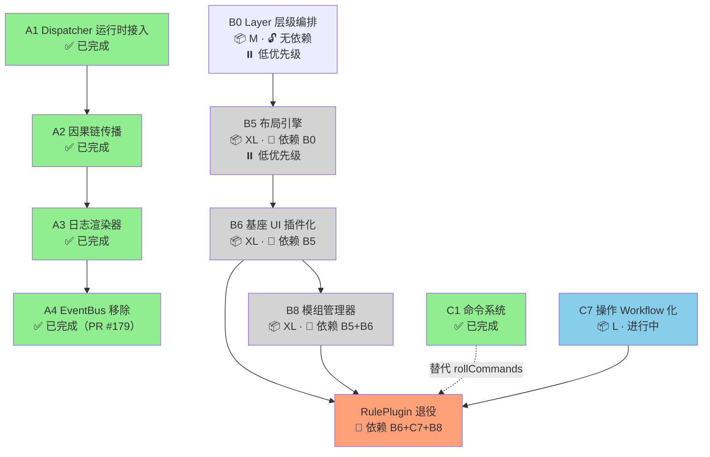

---

## 6 关键架构决策

### 决策 1：Adapter 层退役策略

Token overlay 保留在基座（Canvas 是基座核心），通过 Slot 让插件贡献内容。PortraitBar 整体迁移为插件。

### 决策 2：ChatPanel 渲染器迁移 vs 整体插件化

先实现 `logEntryRenderers`（轨道 A），ChatPanel 保留在基座但使用新渲染器。渲染器通过 `RendererRegistry` 的 `registerRenderer(surface, type, renderer)` 或 `RendererPoint<T>` typed token 注册。`ExtensionRegistry` 已删除（合并进 `RendererRegistry`），不依赖布局引擎。ChatPanel 可以晚一步插件化。

### 决策 3：渐进式 RulePlugin 退役

~~先迁移 surfaces → 再迁移 diceSystem → 再迁移 adapters → 最后删接口。~~

**2026-04-04 更新**：diceSystem ✅ 已完全退役（DaggerHeart 验收证明 workflow + RendererRegistry 可完全替代）。剩余退役顺序：surfaces → adapters → characterUI → dataTemplates → 删除 RulePlugin 接口。

### 决策 4：产品可用性优先

先做轨道 A + C 前半段（让 Daggerheart E2E 链条在所有客户端正确工作），再建设轨道 B（UI 插件化基础设施）。

---

## 7 近中期任务评估

### 评估总览

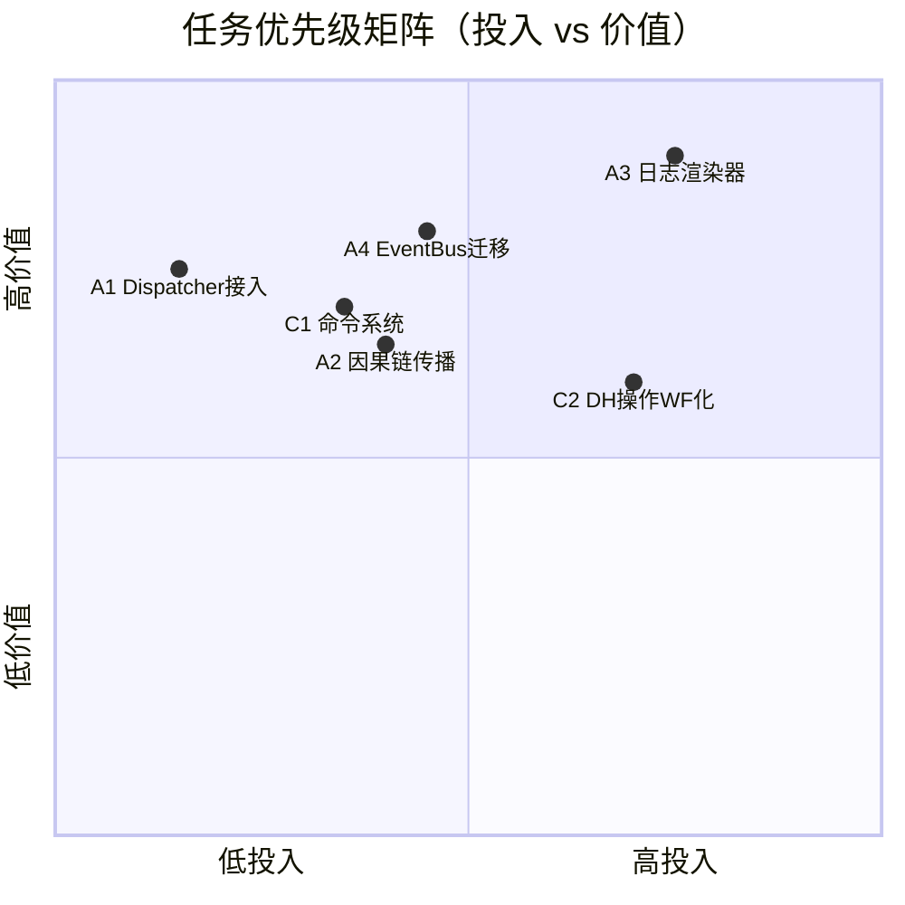

---

### A1. LogStreamDispatcher 运行时接入

| 维度     | 评估                              |
| -------- | --------------------------------- |
| 工作量   | **S**（~50-80 行）                |
| 风险     | **低** — 类和测试已有，只是接入   |
| 产品价值 | 中 — 为多阶段计算链铺路           |
| 架构价值 | **高** — 声明式触发是核心设计承诺 |
| 前置依赖 | 无                                |

**具体工作**：

1. `useWorkflowSDK.ts` 创建 `TriggerRegistry` 单例
2. `ensurePluginsActivated()` 传入 `TriggerRegistry` + `UIRegistry` 给 `PluginSDK`
3. 创建 `LogStreamDispatcher` 实例，绑定 worldStore `log:new` handler
4. Dispatcher 读 `seatId` 和 `logWatermark`

**涉及文件**：`src/workflow/useWorkflowSDK.ts`、`src/workflow/pluginSDK.ts`、`src/stores/worldStore.ts`

---

### A2. 因果链传播（parentId / chainDepth）

| 维度     | 评估                            |
| -------- | ------------------------------- |
| 工作量   | **M**（~150-200 行）            |
| 风险     | **中** — 需设计链上下文传递机制 |
| 架构价值 | **高** — A3 的数据基础          |
| 前置依赖 | 无（A1 之后效果更好）           |

**数据流**：

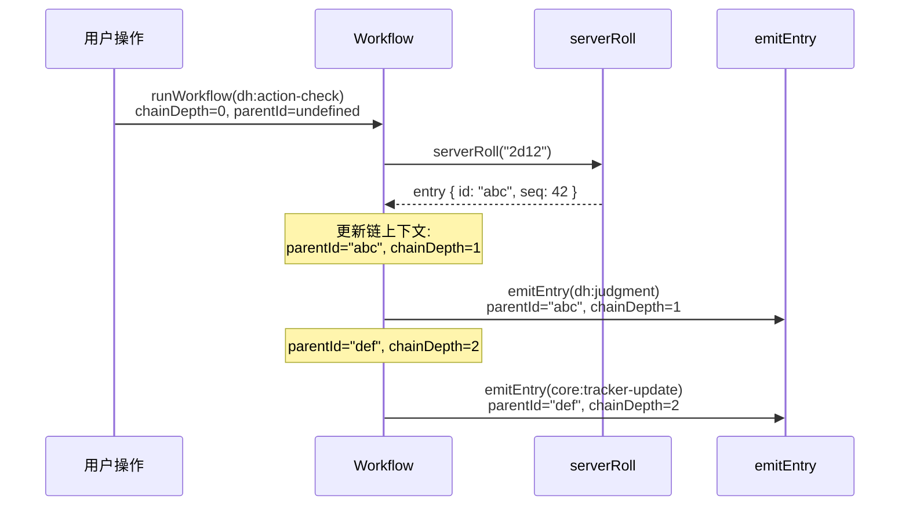

**设计要点**：

- 链上下文是 per-workflow-execution 的，不是全局的
- `serverRoll()` 返回的 entry 成为后续条目的 parent
- `ctx.runWorkflow()` 嵌套时继承链上下文

**涉及文件**：`src/workflow/context.ts`、`src/workflow/types.ts`

---

### A3. 日志条目渲染器（RendererRegistry） — ✅ Step 1-4 完成

| 维度     | 评估                                 |
| -------- | ------------------------------------ |
| 工作量   | **L-XL**（~500-800 行，分 6 步交付） |
| 风险     | **中-高** — ChatPanel 重构           |
| 产品价值 | **高** — 修复跨客户端效果 bug        |
| 架构价值 | **高** — 替代 `rollCardRenderers`    |
| 前置依赖 | G1（groupId，替代原 A2 因果链）      |

**迁移路径**：

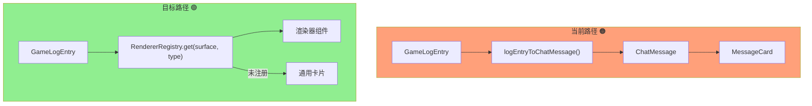

**分步交付**：

| Step | 内容                                                                              | 工作量 | 状态   |
| ---- | --------------------------------------------------------------------------------- | ------ | ------ |
| 1    | RendererRegistry（`(surface, type)` keying + `RendererPoint<T>` typed token）     | S      | ✅     |
| 2    | 基座默认渲染器（`core:text`、`core:roll-result`）                                 | M      | ✅     |
| 3    | 插件渲染器注册（`rollResult('daggerheart:dd')` config），替代 `rollCardRenderers` | M      | ✅     |
| 4    | ChatPanel 迁移到 RendererRegistry + 一次掷骰一张卡                                | L      | ✅     |
| 5    | 因果链分组渲染（按 groupId 聚合）                                                 | M      | 待开始 |
| 6    | 渲染器驱动跨客户端效果（合并 A4）                                                 | M      | 待开始 |

**已完成文件**：`src/log/rendererRegistry.ts`（RendererPoint<T> API）、`src/log/renderers/RollResultRenderer.tsx`（plugin-aware 三路路由）、`src/log/renderers/rollResultDeps.ts`（循环依赖打破）、`src/chat/ChatPanel.tsx`、`src/chat/MessageCard.tsx`
**已删除文件**：`src/ui-system/extensionRegistry.ts`、`plugins/daggerheart-core/DHJudgmentRenderer.tsx`

---

### A4. EventBus 跨客户端效果迁移

| 维度     | 评估                              |
| -------- | --------------------------------- |
| 工作量   | **M**（与 A3.Step6 合并）         |
| 产品价值 | **高** — 修复"只有执行者看到效果" |
| 前置依赖 | **A3**                            |

**迁移模型**：

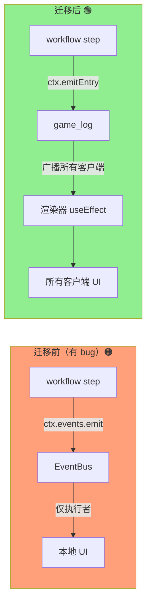

**迁移映射**：

| 事件             | 迁移方式                                 |
| ---------------- | ---------------------------------------- |
| `announceEvent`  | → `ctx.emitEntry({ type: 'core:text' })` |
| `animationEvent` | → 渲染器 `useEffect` 触发                |
| `soundEvent`     | → 渲染器 `useEffect` 触发                |
| `toastEvent`     | **保留** EventBus（纯本地 UI 反馈）      |

---

### C1. 命令系统（sdk.commands.register）

| 维度     | 评估                                               |
| -------- | -------------------------------------------------- |
| 工作量   | **M**（~200-250 行）                               |
| 风险     | **低**                                             |
| 架构价值 | **高** — 替代 `RulePlugin.diceSystem.rollCommands` |
| 前置依赖 | 无                                                 |

**迁移模型**：

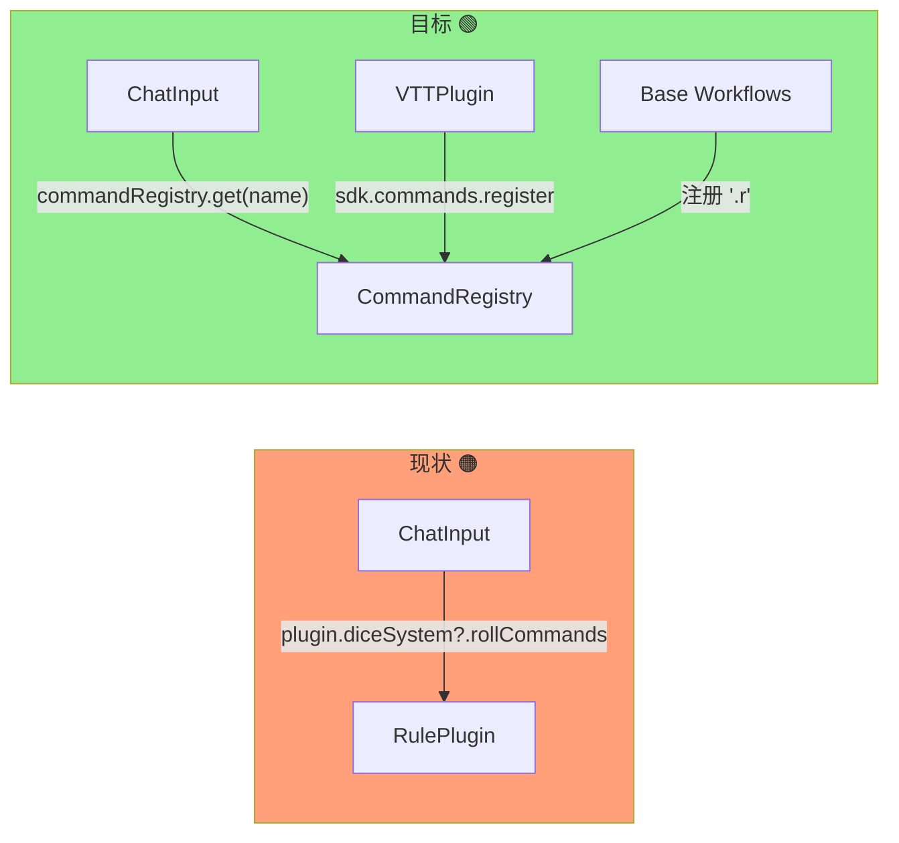

**CommandRegistry 接口**：

```typescript
interface CommandDef {
  name: string // '.dd', '.r'
  description: string
  workflow: WorkflowHandle
  resolveFormula?: (modifier?: string) => string
}

class CommandRegistry {
  register(def: CommandDef): void // 先到先得，冲突失败
  get(name: string): CommandDef | undefined
  getAll(): CommandDef[]
}
```

**涉及文件**：新建 `src/commands/commandRegistry.ts`；修改 `src/chat/ChatInput.tsx`、`src/workflow/pluginSDK.ts`（扩展 IPluginSDK）

> **2026-03-28 更新**：实施方案已简化——不再需要独立的 CommandRegistry。改为在 `defineWorkflow` 上添加 trigger 注解（如 `{ command: '.dd' }`），ChatInput 查询 WorkflowEngine 获取带 command trigger 的 workflow 列表，而非读取 `diceSystem.rollCommands`。

---

### C2. Daggerheart 操作 Workflow 化（Batch 1）

| 维度     | 评估                                |
| -------- | ----------------------------------- |
| 工作量   | **L**（5-6 个操作，共 ~600-900 行） |
| 风险     | **中**                              |
| 架构价值 | **高**（让插件能 hook 操作）        |
| 前置依赖 | 无                                  |

**候选操作**：受伤、治疗、Hope 增减、Stress 增减、Token 放置、资源消耗

**每个操作的模式**：

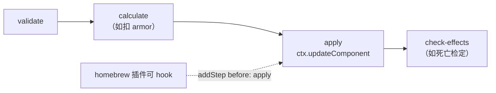

---

## 8 Sprint 路线图

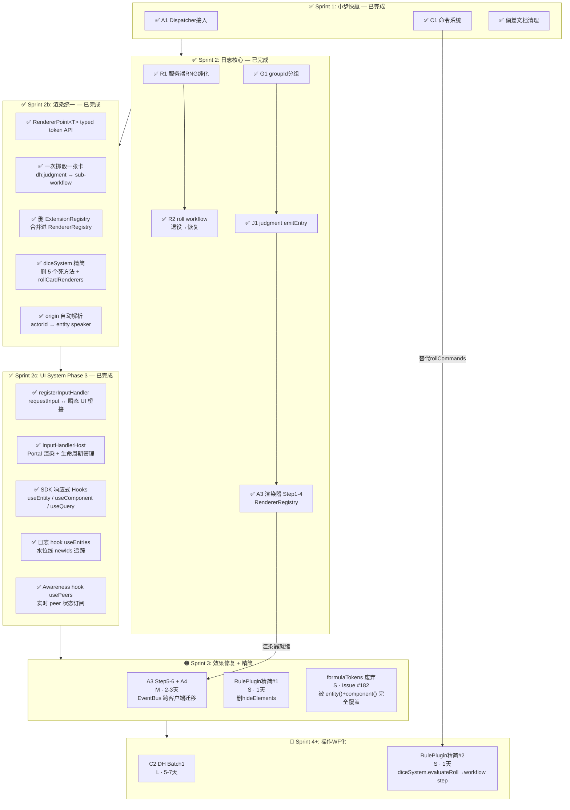

### 路线图逻辑

1. **Sprint 1** ✅：最小投入（S+M），补完两个架构承诺（触发链 + 命令系统），零风险。PR #172 已合并。
2. **Sprint 2** ✅：服务端 RNG 纯化 + groupId 分组 + judgment emitEntry + RendererRegistry。范围从原计划（A2 因果链 + A3 渲染器）调整为 R1/R2/G1/J1/A3，详见 `docs/plans/sprint2-exploration.md`。PR #174。
   - **偏差**：A2 因果链传播被 G1 groupId 替代；R2 roll workflow 先退役后恢复。详见 `docs/plans/sprint2-deviations.md`。
   - **已知遗留**：Workflow 全局单例 addStep 影响所有调用方 → [Issue #176](https://github.com/RidRisR/myVTT/issues/176)
   - **Sprint 2b（渲染统一）**：`RendererPoint<T>` typed token API；一次掷骰只发一条日志一张卡（`dh:judgment` 改为 sub-workflow）；删除 `ExtensionRegistry`（合并进 `RendererRegistry`）；删除 `diceSystem` 5 个死方法 + `rollCardRenderers`；`context.ts` origin 自动解析（actorId → entity speaker）。
3. **Sprint 2c（UI System Phase 3）** ✅：补全 SDK 架构缺口。`registerInputHandler` 桥接 `requestInput` 与瞬态 UI，`InputHandlerHost` 通过 Portal 渲染；SDK 响应式数据 hooks（`useEntity`/`useComponent`/`useQuery`）通过 `useSyncExternalStore` 实现，日志 hook `useEntries` 带水位线追踪，Awareness hook `usePeers` 订阅 peer 状态。PR #181 已合并。
   - **设计文档**：`20-UI注册系统扩展方案.md`（Input Handler）、`21-SDK响应式数据订阅方案.md`（响应式 Hooks）
   - **已知遗留**：`formulaTokens(entityId)` 功能冗余（被 `entity()`+`component()` 完全覆盖）且类型假设错误（`Record<string, number>`）→ [Issue #182](https://github.com/RidRisR/myVTT/issues/182)
4. **Sprint 3**：修复跨客户端效果 bug（EventBus 迁移）+ 继续精简 RulePlugin（删 `hideElements` + 废弃 `formulaTokens`）
5. **Sprint 4+**：操作 workflow 化，独立轨道，逐步推进；`diceSystem.evaluateRoll`/`getJudgmentDisplay` 迁移为 workflow step

---

## 9 布局引擎独立性分析

> 结论：布局引擎可独立建设，不触发逻辑层重写。属于低优先级。

### Workflow 架构保证逻辑层解耦

- `ctx.updateComponent()` 不关心面板在哪
- `runner.runWorkflow()` 不关心按钮在哪个面板
- `useEntity()/useComponent()` 不关心渲染容器的 position 策略
- EventBus fire-and-forget，不关心订阅者在哪层

### 当前布局天然兼容

| 特征         | 现状                                                | 对布局引擎的影响     |
| ------------ | --------------------------------------------------- | -------------------- |
| 布局策略     | 所有面板 `position: fixed` + 显式坐标               | ✅ 无 grid/flex 耦合 |
| Z-index      | 语义化分层（tactical < ui < popover < overlay）     | ✅ 引擎可直接复用    |
| Pointer 隔离 | `pointer-events: none/auto`（非 stopPropagation）   | ✅ 引擎可沿用        |
| Portal       | PluginPanelContainer 已用 `createPortal(body)`      | ✅ 已脱离祖先        |
| 定位         | `left/top`（非 `transform`，避免 containing block） | ✅ 已遵循约束        |

### 需注意的交互问题

| 问题                 | 严重度  | 说明                                |
| -------------------- | ------- | ----------------------------------- |
| DnD 多源共存         | ⚠️ 已知 | 需设计编辑/普通模式切换，但不是重写 |
| Konva 坐标映射       | ⚠️ 可控 | TacticalPanel 保持全屏，不受影响    |
| Radix Portal z-index | ⚠️ 可控 | z-ui < z-popover 已有安全余量       |

### 共存策略

阶段 1：硬编码 UI 继续 `position:fixed`，新面板由布局引擎通过 `createPortal` 管理，两类面板共存。
阶段 2：硬编码面板逐个迁移为插件注册面板（迁移时不改组件内部代码）。

---

## 9b Layer 层级编排方案（B0）

> **核心原则**：插件声明能力（注册到语义化层级槽位），平台提供编排基础设施，用户决定最终排序。

### 问题

当前 `registerLayer(def: LayerDef)` 中 `zLayer` 只有三个固定档次（`below-canvas` / `above-canvas` / `above-ui`）。同一档内多个 Layer 的排序完全取决于 `layers.push()` 的调用顺序（即插件注册顺序），不可控。

对于简单场景（canvas 下方的背景层、canvas 上方的 token 信息层）三档足够。但复杂场景（如视觉小说：背景 → 立绘 → 对话框 → 特效层）需要同一档内的细粒度排序，且排序权应在用户手中。

### 非矩形 UI 与 Panel vs Layer 的分工

Panel（面板）受 `contain: layout paint` + `overflow: hidden` 限制，是矩形裁剪的。但 Layer（全局图层）覆盖整个视口（`inset: 0`），无裁剪约束，适合非矩形、需要穿插叠加的 UI（立绘、粒子特效、自定义光照等）。

| 场景         | 适合的组件类型 | 原因                          |
| ------------ | -------------- | ----------------------------- |
| 角色面板     | Panel          | 独立矩形区域，用户可拖拽/布局 |
| 视觉小说立绘 | Layer          | 非矩形、需要跨区域穿插        |
| 天气/粒子    | Layer          | 全屏覆盖，不受矩形裁剪        |
| 对话框       | Layer          | 需要与立绘有精确的层叠关系    |
| 数据面板     | Panel          | 独立内容区域                  |

### 设计方向

**参考业界实践**：

- **OBS Studio**：插件注册 Source 类型，用户在 Scene 中通过列表拖拽控制 z-order
- **FoundryVTT**：平台定义固定 Canvas Layer 层级（Background → Tokens → Effects），同层内元素由 GM 通过右键菜单排序
- **Unity 2D**：引擎定义 Sorting Layer，同层内用 `order in layer` 数值排序，开发者可在 Inspector 调整
- **Figma/Photoshop**：插件生成的元素进入图层树后，排序权完全交给用户

**共同模式**：

1. 平台定义有限的语义化层级槽位（不是无限数字）
2. 插件声明"建议放在哪个槽位"，但不控制最终位置
3. 用户通过平台编排 UI 决定同槽位内的最终顺序
4. 编排结果持久化在用户侧（layout 配置）

**改造要点**：

1. `LayerDef` 新增可选 `suggestedOrder?: number`（插件建议值，仅在用户未手动排序时生效）
2. `LayoutConfig` 扩展：存储同 `zLayer` 内各 layer 的用户自定义排序
3. 基座提供图层管理 UI（Layer Panel），允许用户拖拽调整同档内图层顺序
4. 排序优先级：用户 layout 配置 > 插件 suggestedOrder > 注册顺序

### 工作量评估

| 项目           | 大小 | 说明                                     |
| -------------- | ---- | ---------------------------------------- |
| LayerDef 扩展  | S    | 新增字段，兼容现有接口                   |
| Layout 持久化  | S    | 扩展 LayoutConfig schema                 |
| Layer Panel UI | M    | 基座提供的图层管理面板，支持拖拽排序     |
| 合计           | M    | 可在布局引擎之前独立实施，不依赖其他轨道 |

### 实施时机

属于轨道 B 的前置任务（B0）。当有插件需要注册多个需要精确排序的 Layer 时实施。当前三档满足已有需求，不急于实施。

---

## 10 Workflow 三种触发方式

Sprint 1 完成后，workflow 有三种完整的触发入口：

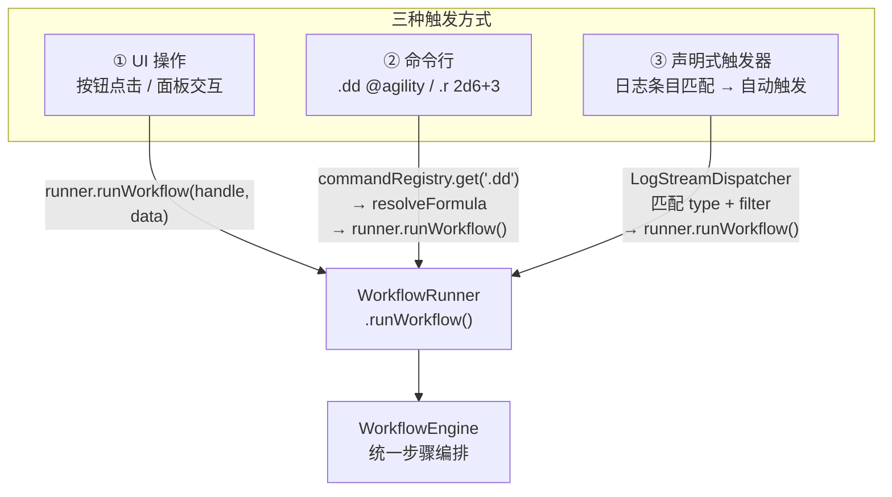

| 触发方式  | 入口                             | Sprint 1 前          | Sprint 1 后               |
| --------- | -------------------------------- | -------------------- | ------------------------- |
| ① UI 操作 | `onClick → runner.runWorkflow()` | ✅                   | ✅                        |
| ② 命令行  | ChatInput → rollCommands         | ✅ 但挂在 RulePlugin | ✅ 迁移到 CommandRegistry |
| ③ 触发器  | `log:new → Dispatcher`           | ❌ 未接入            | ✅ 接入运行时             |

---

## 11 状态触发与能力边界

### 状态触发不需要独立机制

TTRPG 是回合制游戏，所有状态变更都经过日志条目（`core:component-update`）。"状态触发"可建模为**带谓词的事件触发**：

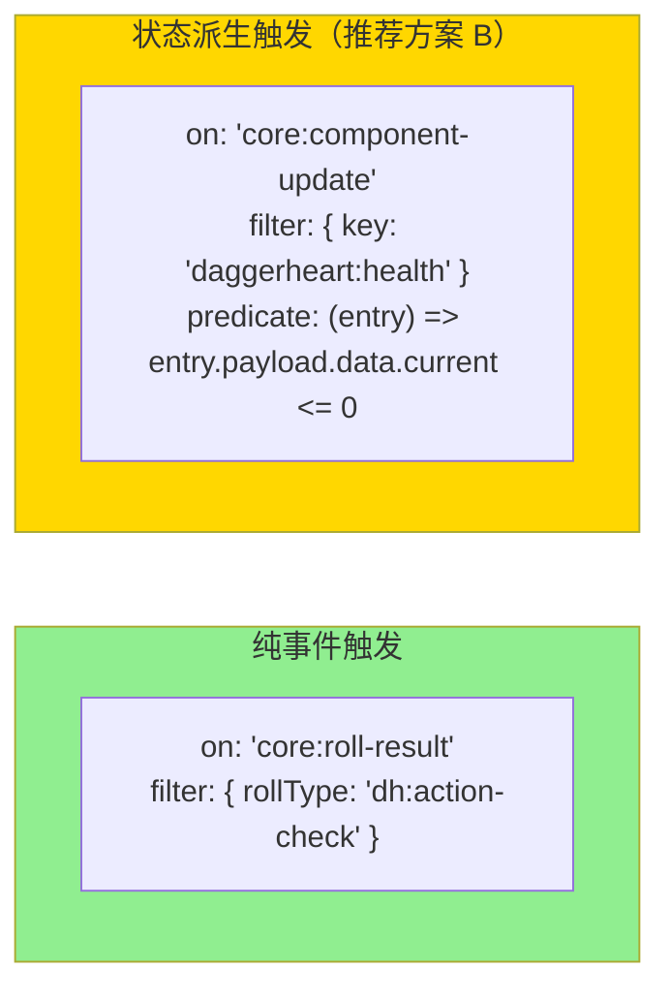

### 三种方案

| 方案                                    | 修改量     | 说明                                          |
| --------------------------------------- | ---------- | --------------------------------------------- |
| A. workflow 步骤内检查                  | 0          | 已有模式，覆盖大部分场景                      |
| **B. TriggerDefinition 加 `predicate`** | **~20 行** | **推荐：A1 时顺手加**                         |
| C. zustand store watcher                | ~200+ 行   | 不推荐：循环风险、executor 归属不明、性能开销 |

**推荐**：A1 接入 Dispatcher 时顺手给 TriggerDefinition 加 `predicate` 函数（~20 行），未来需要时立即可用。

### 能力边界

TTRPG 不存在需要"持续监控"的场景。所有"持续"效果分解为离散事件点上的检查（如 `core:turn-start`）。三个机制组合覆盖所有响应场景：

| 机制                         | 用途                                         |
| ---------------------------- | -------------------------------------------- |
| 事件触发器（trigger）        | 跨 workflow 的响应（"发生 X 时启动 Y"）      |
| workflow 步骤注入（addStep） | workflow 内的拦截（"做 X 的过程中插入检查"） |
| requestInput                 | 需要人类决策的暂停点                         |

---

## 12 跨客户端协调

### 不需要跨客户端 workflow 执行

跨客户端协调通过**触发链**实现，不需要"一个 workflow 跨两个客户端运行"：

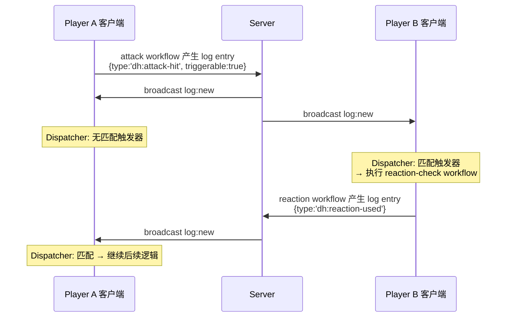

### 前置条件

只需 **A1（Dispatcher 接入）**——已是 Sprint 1 的任务。

### 对 Daggerheart 的影响

**优先级低**。DH 是叙事型游戏，很少需要跨客户端反应。D&D 的"反应动作"是典型场景，但属于未来 D&D 插件的需求。

---

## 13 Workflow 引擎设计边界

> **核心原则**：引擎保持线性 pipeline，所有流程控制在 step body 内用宿主语言原生代码处理。不引入分支、循环、条件注入等流程控制原语。

### 13.1 不引入条件 Step 注入

Step 一旦静态注册就始终在 pipeline 中。"条件执行"通过 step body 内的 guard 实现：

```typescript
// ✅ 正确：step body 内部一行 guard
run: (ctx) => {
  if (ctx.vars.judgment?.outcome !== 'success_hope') return
  // 仅 success_hope 时执行的逻辑
}

// ✅ 正确：wrapStep 做条件绕过
sdk.wrapStep(workflow, 'calculate', {
  run: async (ctx, next) => {
    if (ctx.vars.hasShield) return  // 跳过原 step
    await next()
  },
})

// ❌ 不做：引擎级条件属性
{ id: 'my-step', condition: (ctx) => ..., run: ... }
```

**拒绝理由**：

- `inspectWorkflow()` 无法静态列出实际执行的 steps
- `before: 'that-step'` 的 step 在目标条件性缺席时排序语义模糊
- step body 内的 `if/return` 已完全等价，零额外复杂度

### 13.2 不引入分支原语

分支通过 `ctx.runWorkflow()` 子调度实现：

```typescript
// ✅ 分支差异大（不同 step 序列）→ 拆子 workflow
{ id: 'route', run: async (ctx) => {
    const wf = { critical: criticalWf, hit: normalWf, miss: missWf }[ctx.vars.outcome]
    if (wf) await ctx.runWorkflow(wf, ctx.vars)
}}

// ✅ 分支差异小（同样的 step 只是参数不同）→ if/else 守卫
// 例：dh:action-check 的 resolve step，4 个 outcome 都只做 updateTeamTracker
{ id: 'dh:resolve', run: (ctx) => {
    if (outcome === 'success_hope' || outcome === 'failure_hope')
      ctx.updateTeamTracker('Hope', { current: 1 })
    else if (outcome === 'success_fear' || outcome === 'failure_fear')
      ctx.updateTeamTracker('Fear', { current: 1 })
}}
```

**设计指导**：何时用哪种方式是工程判断，不是架构规则。

### 13.3 不引入循环原语

循环通过 step body 内的原生 for 循环 + `ctx.runWorkflow()` 实现：

```typescript
// AOE 伤害多个目标
{ id: 'aoe:apply-all', run: async (ctx) => {
    for (const targetId of ctx.vars.targetIds) {
      await ctx.runWorkflow(singleDamageWf, { targetId, damage: ctx.vars.damage })
    }
}}
```

### 13.4 共享变量做分支控制

`ctx.vars` 是 step 间通信的唯一机制，也自然地充当分支信号：

```
step: roll       → 写入 ctx.vars.rolls, ctx.vars.total
step: dh:judge   → 读 rolls/total，写入 ctx.vars.judgment   ← 分支信号
step: dh:resolve → 读 judgment，决定行为
step: display    → 读 judgment，决定显示
```

**契约模型**：`WorkflowHandle<TData>` 泛型提供编译时类型约束，运行时宽松（`[key: string]: unknown]` 允许插件扩展）。当前规模下不需要 runtime schema 校验。

### 13.5 业界先例

| 系统                | 模型                         | 规模                     |
| ------------------- | ---------------------------- | ------------------------ |
| **Temporal.io**     | workflow = 代码，无流程 DSL  | Uber/Stripe 支付流程     |
| **Webpack Tapable** | 线性 Hook + tap 回调         | 几百个插件协作           |
| **Express/Koa**     | 线性 middleware + next()     | Node.js 生态基石         |
| **WordPress Hooks** | add_action/add_filter 线性链 | 上万个插件生态           |
| **Foundry VTT**     | Hook 链 + 回调               | TTRPG 领域最活跃模组生态 |

共同特征：**引擎保持"笨"，生态反而繁荣**。引擎引入流程控制原语会提高插件作者门槛（学引擎 DSL + 宿主语言），反而抑制生态。

---

## 14 UI 渲染器 Registry 设计

> ⚠️ **已演进**：本节设计的独立 RendererRegistry 已被统一的 ExtensionRegistry 替代。SlotRegistry + RendererRegistry 合并为一个 registry，通过 `sdk.ui.contribute(extensionPoint, component)` 注册。详见 [UI 系统重构设计 Spec §4.2](../superpowers/specs/2026-03-28-ui-system-refactor-design.md)。以下内容保留作为设计推演记录。

> **核心结论**：渲染器 Registry 本质是一个扁平的 `Map<string, Component>`。不需要平台特权，不需要二维表。key 命名是约定，插件与 UI 之间的耦合不可消除也不需要消除。

### 14.1 基础模型

```typescript
// 基座提供的基础设施 —— 极薄
class RendererRegistry {
  private map = new Map<string, ComponentType<{ entry: GameLogEntry }>>()
  register(key: string, component: ComponentType): void // 写入，后注册可覆盖
  get(key: string): ComponentType | undefined // 读取
}
```

任何人（基座或插件）都可以注册，任何 UI 面板都可以查询。

### 14.2 日志渲染流程

```
插件激活时注册渲染器（已演进为 ExtensionRegistry contribute）：
  daggerheart-core  →  sdk.ui.contribute(logRenderer('dh:judgment'), DaggerheartJudgmentCard)
  daggerheart-core  →  sdk.ui.contribute(logRenderer('dh:roll-result'), DaggerheartRollCard)
  base              →  sdk.ui.contribute(logRenderer('core:text'), TextCard)

渲染时查表：
  ChatPanel 收到 entry { type: 'dh:judgment', payload: {...} }
  const Card = extensionRegistry.get(logRenderer(entry.type)) ?? DefaultLogCard
  <Card entry={entry} />
```

消费面板不关心有哪些插件注册了什么——查 key，找到就用，找不到就兜底。

### 14.3 日志条目结构

```typescript
interface GameLogEntry {
  id: string // UUIDv7
  type: string // 'dh:judgment' —— 渲染器查找 key
  tags?: string[] // ['dice-result'] —— 过滤/分组用
  payload: unknown // 插件自定义，由注册渲染器的插件消费
  parentId?: string // 因果链
  chainDepth?: number
  // ... timestamp, seatId, visibility 等通用字段
}
```

`type` 和 `tags` 职责不重叠：

- **type**：唯一名称，用于精确查找渲染器
- **tags**：分类标签，用于跨类型过滤（如"只显示骰子相关日志"）

### 14.4 跨插件消费

生产者和消费者不需要互相了解，只需要了解 key 名和 payload 契约：

```
daggerheart 插件写日志：
  ctx.emitEntry({
    type: 'dh:judgment',
    tags: ['dice-result'],
    payload: { outcome: 'success_hope', rolls: [5, 7], total: 12, formula: '2d12' }
  })

daggerheart 插件注册渲染器（同一个插件，契约内部闭合）：
  sdk.ui.contribute(logRenderer('dh:judgment'), ({ entry }) => {
    const { outcome, rolls } = entry.payload as DHJudgmentPayload
    return <JudgmentCard outcome={outcome} rolls={rolls} />
  })
```

如果一个通用 UI 插件想渲染所有骰子结果，它通过 `tags` 过滤条目，然后对每条条目查 registry 获取渲染器。它不需要知道 `dh:judgment` 的存在——只要 entry 有 `tags: ['dice-result']`，它就显示；渲染交给 registry 查到的组件。

### 14.5 不需要平台特权

对比 VS Code 模型（平台定义所有扩展点，插件只能往里填），我们选择更开放的模型：

- registry 是一个自由的 key-value 表
- 谁都可以注册 key（基座、第一方插件、第三方插件）
- key 命名是约定（如 `namespace:type`），不是平台强制的枚举
- 类比：WordPress 的 `add_filter('the_content', fn)` —— `the_content` 不是平台"声明"的，就是大家都知道的字符串

插件知道 UI 的存在（知道要往哪个 key 注册）是插件开发的基本前提，不是架构缺陷。

### 14.6 角色卡等复杂 UI

日志渲染器是"多对一"：多个插件往同一个面板注册不同类型的卡片。

角色卡是"一对一"：一个插件提供完整的角色卡组件，填入基座预留的槽位。这是 `sdk.ui.contribute()` 的场景（轨道 B），与日志渲染器共用同一个 ExtensionRegistry，通过 `get()` vs `getAll()` 区分单一/多贡献。

---

## 15 偏差文档更新

> ✅ **已完成** — `16a-实现偏差说明.md` 已合并入 `16-事件日志与骰子系统架构.md` 末尾偏差摘要节，并归档至 `docs/archive/design-history/`。偏差 10 状态已修正为已修复，偏差 11/12 仍成立并已在路线图中跟踪。
