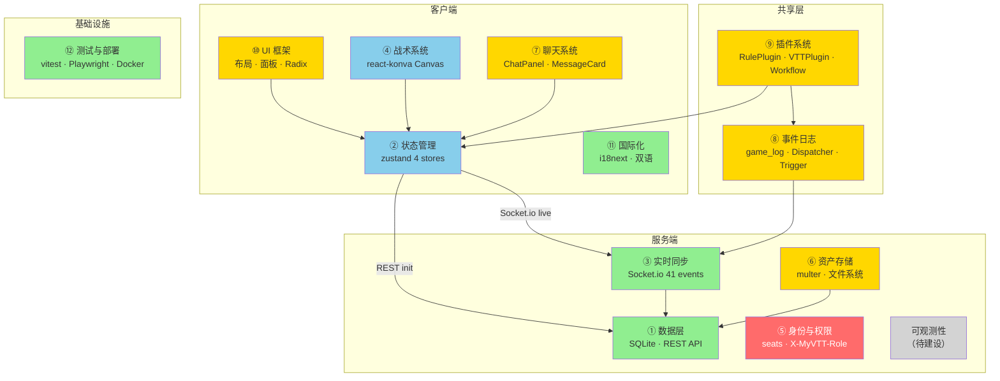
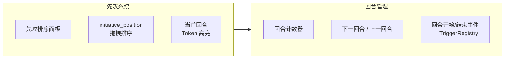
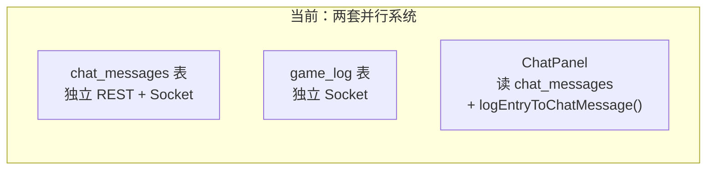
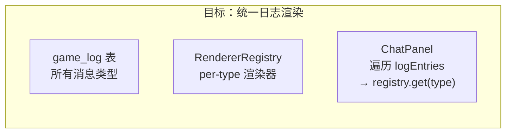
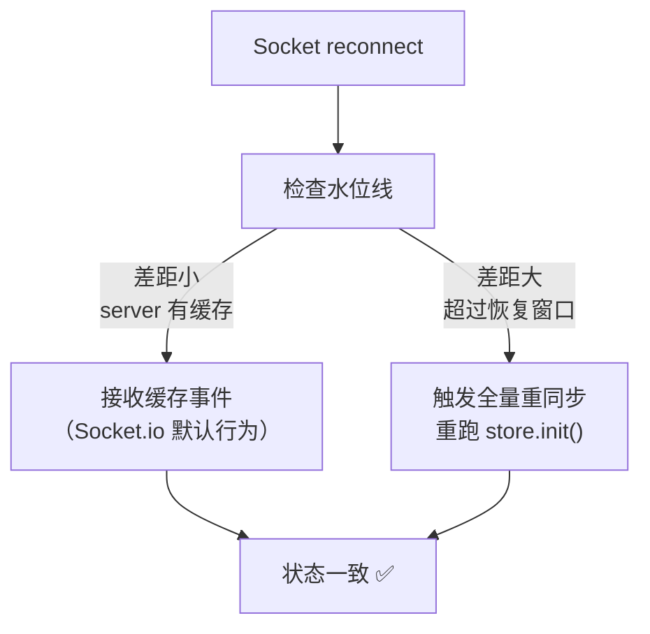
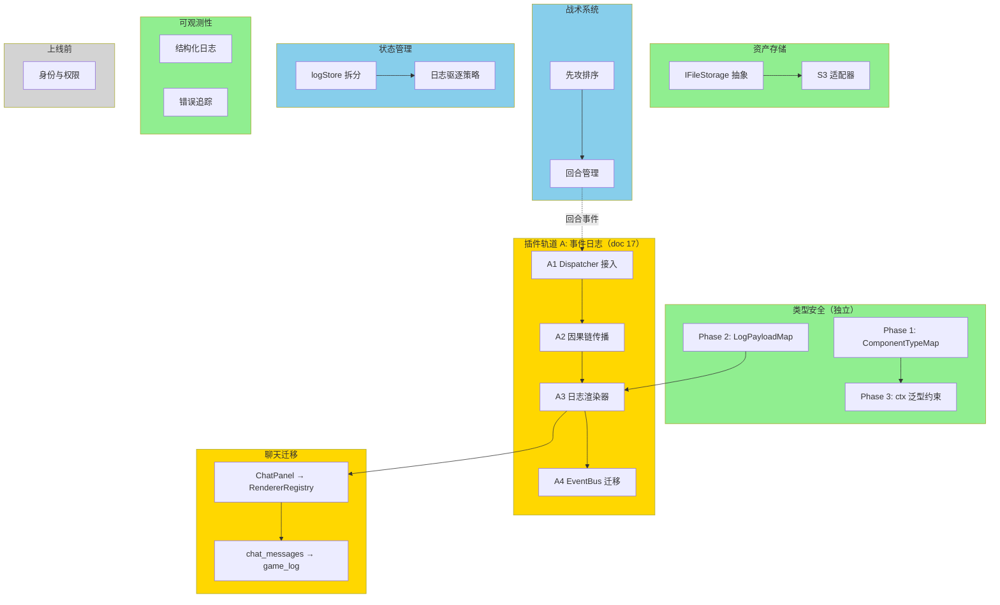

# 系统架构现状与演进分析

> **状态**：规划中 | 2026-03-25
> **前置文档**：`17-插件系统演进路线.md`、`docs/architecture/overview.md`
> **范围**：全系统子系统盘点、成熟度评估、跨领域演进议题、整体路线图

---

## 目录

1. [系统全景图](#1-系统全景图)
2. [子系统成熟度矩阵](#2-子系统成熟度矩阵)
3. [各子系统详细分析](#3-各子系统详细分析)
4. [跨领域演进议题](#4-跨领域演进议题)
5. [跨系统演进依赖图](#5-跨系统演进依赖图)
6. [整体优先级路线图](#6-整体优先级路线图)

---

## 1 系统全景图



图例：🟢 生产就绪 · 🟡 基本可用/需演进 · 🔴 缺失 · ⬜ 待建设

---

## 2 子系统成熟度矩阵

| #   | 子系统                  | 成熟度        | 演进需求 | 优先级 | 关键文件                                                      |
| --- | ----------------------- | ------------- | -------- | ------ | ------------------------------------------------------------- |
| ①   | 数据层（SQLite + REST） | ✅ 生产就绪   | 低       | —      | `server/schema.ts`, `server/db.ts`, `server/routes/*.ts`      |
| ②   | 状态管理（zustand）     | ✅ 生产就绪   | 中       | 中     | `src/stores/worldStore.ts` (~1000 行)                         |
| ③   | 实时同步（Socket.io）   | ✅ 生产就绪   | 低       | —      | `server/ws.ts`, `server/awareness.ts`                         |
| ④   | 战术系统（react-konva） | ✅ 核心完整   | 中       | 中     | `src/combat/KonvaMap.tsx`, `server/routes/tactical.ts`        |
| ⑤   | 身份与权限              | 🔴 缺失       | 高       | 延后   | `server/middleware.ts`, `src/stores/identityStore.ts`         |
| ⑥   | 资产存储                | 🟡 纯文件系统 | 中       | 中     | `server/routes/assets.ts`, `server/index.ts`                  |
| ⑦   | 聊天系统                | 🟡 基本可用   | 中       | 中     | `src/chat/ChatPanel.tsx`, `server/routes/chat.ts`             |
| ⑧   | 事件日志（game_log）    | 🟡 基本可用   | 中       | 高     | `server/logHandler.ts`, `src/workflow/logStreamDispatcher.ts` |
| ⑨   | 插件系统                | 🟡 基本可用   | 高       | 高     | 见 `17-插件系统演进路线.md`                                   |
| ⑩   | UI 框架（布局/面板）    | 🟡 基本可用   | 中       | 低     | `src/layout/`, `src/gm/`                                      |
| ⑪   | 国际化（i18n）          | ✅ 生产就绪   | 低       | —      | `src/i18n/index.ts`, `src/i18n/pluginI18n.ts`                 |
| ⑫   | 测试与部署              | ✅ 生产就绪   | 低       | —      | `vite.config.ts`, `Dockerfile`                                |

---

## 3 各子系统详细分析

### 3.1 数据层 — ✅ 生产就绪

**现状**：双数据库架构（`global.db` + per-room `room.db`），14 张表（含 `game_log` 和 `entity_components`），WAL 模式，外键约束。11 个 REST 路由模块覆盖所有 CRUD。

**架构优势**：

- 房间完全隔离，互不影响
- `toCamel` / `parseJsonFields` / `toBoolFields` 统一命名转换
- Schema 集中在 `server/schema.ts`，结构清晰

**已知缺口**：无 Schema 迁移机制（`ALTER TABLE`），当前依赖 `CREATE TABLE IF NOT EXISTS`。版本升级时已有 `room.db` 可能缺少新字段。

**演进建议**：Schema 版本管理属上线前议题，当前不阻塞开发。

---

### 3.2 状态管理 — ✅ 生产就绪，需优化

**现状**：4 个 zustand store（`worldStore` ~1000 行、`identityStore` ~200 行、`assetStore` ~100 行、`uiStore` ~100 行）。28 个 Socket.io 事件监听器。悲观更新为主，仅 3 处乐观更新。

**架构优势**：

- 职责分离清晰（业务/身份/资产/UI）
- Selector 规则严格（禁止 store 内 `.filter()/.sort()`，模块级 fallback 常量）
- 原子性更新（flags + data 同一个 `set()` 调用）

**已知缺口**：

| 问题                         | 影响                                                    | 严重度 |
| ---------------------------- | ------------------------------------------------------- | ------ |
| worldStore 体积持续膨胀      | 新功能（game_log、archives、trackers）都加入 worldStore | ⚠️ 中  |
| `logEntries` 无驱逐策略      | 长 session 下内存持续增长                               | ⚠️ 中  |
| `freshChatIds` 硬编码 2500ms | CSS 动画与 JS 常量耦合                                  | 🟢 低  |

**演进建议**：

1. **logStore 独立拆分**（工作量 M）
   - 将 `logEntries`、`logEntriesById`、`logWatermark` 及相关 Socket 监听抽为独立 `logStore`
   - worldStore 不再承担日志职责，体积减少 ~15%
   - 日志驱逐策略（如保留最近 500 条 + 按需加载历史）可在新 store 中实现

2. **驱逐策略**：保留最近 N 条 + `log:history` REST API 按需翻页加载

---

### 3.3 实时同步 — ✅ 生产就绪

**现状**：35 个数据广播事件 + 6 个感知事件（cursor、tokenDrag、presence）。Socket.io 4.8 connection recovery（2 分钟窗口）。服务端中继感知事件不持久化。

**架构优势**：

- 事件命名规范统一（`domain:action`）
- 每个客户端 `socket.on()` 都有对应的服务端 `io.to(roomId).emit()`
- 新连接通过 REST `init()` 获取全量数据（catch-up 完整）

**演进建议**：当前无需改动。断线重连韧性在 §4.3 讨论。

---

### 3.4 战术系统 — ✅ 核心完整，功能待补

**现状**：

- Token CRUD + 拖拽 + 网格吸附 + 存档 save/load ✅
- GhostToken 跨客户端拖拽预览 ✅
- 6 个 REST 端点（GET/PATCH tactical、POST/PATCH/DELETE tokens）✅
- Archive 系统（ephemeral 快照 / reusable+persistent 引用）✅

**架构优势**：

- react-konva 分层渲染（Background → Grid → Tokens → Tools）
- Token 拖拽使用 awareness 事件（60fps 本地 → Socket.io 中继 → 其他客户端 GhostToken）
- 存档隔离策略合理（immutable template，load 不修改原存档）

**已知缺口**：

| 预留字段                | 表                | 状态      |
| ----------------------- | ----------------- | --------- |
| `initiative_position`   | `tactical_tokens` | ❌ 未接线 |
| `round_number`          | `tactical_state`  | ❌ 未使用 |
| `current_turn_token_id` | `tactical_state`  | ❌ 未使用 |

**演进建议**：

先攻与回合管理系统（工作量 L）：



- 先攻排序面板 + 拖拽重排
- 回合开始/结束事件 → 可与 TriggerRegistry 联动（插件 hook 回合事件）
- 条件标记系统（如"昏迷"、"中毒"）可作为后续扩展

---

### 3.5 身份与权限 — 🔴 缺失（延后至上线前）

**现状**：

- `seats` 表管理座位（name、color、role、portrait）
- `X-MyVTT-Role` header 区分 GM/PL（可被伪造）
- Socket.io auth 仅验证 `roomId` 存在
- `sessionStorage` 保存 `mySeatId`（刷新恢复）

**影响评估**：身份系统独立于核心逻辑。当前 Entity 权限（`permissions` JSON）、`withRole` 中间件已预埋接入点。正式上线前实现 JWT 鉴权 + 服务端权限校验即可。

**已有设计**：

- `06-身份系统与WebSocket鉴权方案设计.md` — JWT + 用户账户 + Socket.io 认证
- `07-权限与数据隔离方案设计.md` — 服务端数据隔离策略

---

### 3.6 资产存储 — 🟡 纯文件系统，需抽象

**现状**：

```
用户上传 → multer → data/rooms/{roomId}/uploads/{filename}
                                    ↓
                          express.static 静态服务
                                    ↓
                     前端通过相对 URL 引用（/api/rooms/.../uploads/...）
```

- 上传：`multer` 中间件写入磁盘（`server/routes/assets.ts`）
- 服务：`express.static` / `res.sendFile()`（`server/index.ts`）
- 删除：`fs.unlinkSync()`（`server/routes/assets.ts`）
- 元数据：SQLite `assets` 表存 URL、type、tags

**问题**：

| 问题             | 影响                                     |
| ---------------- | ---------------------------------------- |
| 耦合单机文件系统 | 无法水平扩展、无法多副本部署             |
| 无 CDN 分发      | 所有资源请求经过 Express，大文件影响性能 |
| 相对路径存储     | 迁移到云存储需处理已有 URL 兼容          |
| 删除直接操作磁盘 | 无垃圾回收、无软删除保护期               |

**演进方案详见 §4.2**。

---

### 3.7 聊天系统 — 🟡 需迁移到事件日志

**现状**：



- `chat_messages` 表：独立的 REST CRUD + `chat:new` Socket 事件
- `game_log` 表：通过 `log:entry` / `log:new` Socket 事件
- `ChatPanel` 混合渲染：直接读 `chatMessages` + 通过 `logEntryToChatMessage()` 转换 game_log 条目为 ChatMessage 格式

**问题**：

| 问题                                      | 影响                       |
| ----------------------------------------- | -------------------------- |
| 两套消息存储（chat + game_log）           | 数据分散，查询和回放复杂   |
| `logEntryToChatMessage()` 转换层          | 额外的映射代码，类型不安全 |
| ChatPanel 渲染路径独立于 RendererRegistry | 无法统一由插件贡献渲染器   |

**演进方向**：统一到 `game_log` + `RendererRegistry`（与 doc 17 轨道 A 协同）：



- 纯文本聊天 → `game_log` type=`core:text`
- 骰子结果 → `game_log` type=`core:roll-result`
- 插件自定义 → `game_log` type=`dh:judgment` 等
- `chat_messages` 表逐步废弃

---

### 3.8 事件日志 — 🟡 基础设施完备，运行时待接入

**现状**：

已完成（详见 `16-事件日志与骰子系统架构.md`）：

- `game_log` 表 + 双 ID 设计（`id` + `seq`）✅
- Socket.io 传输（`log:entry` / `log:roll-request` / `log:history` / `log:new`）✅
- `effectRegistry`（`core:tracker-update` / `core:component-update`）✅
- Visibility 过滤 + 执行者路由 ✅
- `LogStreamDispatcher` 类 + `TriggerRegistry` 类 ✅
- Transport wiring（`emitEntry` / `serverRoll`）✅

未完成：

- ❌ Dispatcher 运行时接入（doc 17 Sprint 1 A1）
- ❌ 因果链传播（parentId / chainDepth）
- ❌ 日志条目渲染器（RendererRegistry）
- ❌ EventBus 跨客户端迁移

**演进路线**：已在 doc 17 轨道 A 详细规划，此处不重复。

---

### 3.9 插件系统 — 🟡 已有独立路线图

详见 `17-插件系统演进路线.md`。核心演进方向：

- 三条轨道：事件日志完善 → UI 插件化 → 操作 Workflow 化
- 终态：只有 VTTPlugin，RulePlugin 退役
- 4 个 Sprint，预计 ~20 天

---

### 3.10 UI 框架 — 🟡 硬编码布局，布局引擎低优先级

**现状**：

- 所有面板 `position: fixed` + 显式坐标
- Z-index 语义化分层（tactical < ui < popover < overlay）
- Pointer 隔离使用 `pointer-events: none/auto`（非 stopPropagation）
- `PluginPanelContainer` 已用 `createPortal(body)` 脱离祖先

**架构优势**：当前布局策略天然兼容未来的布局引擎（详见 doc 17 §9 布局引擎独立性分析）。

**演进建议**：布局引擎属低优先级。当前硬编码布局可用且无阻塞。待插件系统成熟后再考虑。

---

### 3.11 国际化 — ✅ 生产就绪

**现状**：i18next + react-i18next，zh-CN / en 双语，HTTP 后端加载，插件 i18n 通过 `usePluginTranslation()` 支持参数插值。

**演进建议**：无。

---

### 3.12 测试与部署 — ✅ 生产就绪

**现状**：

- vitest：jsdom（前端）+ node（服务端），覆盖率阈值 70/55/60/70
- Playwright：8+ E2E 场景（smoke、多客户端同步、重连等）
- Docker：multi-stage build，生产镜像精简
- `./scripts/preview` CLI：一键启动 Docker 预览环境

**演进建议**：

- 覆盖率可逐步提升（当前 `src/combat/` 排除在外）
- Debug panel 缺少自动化测试（低优先级）

---

## 4 跨领域演进议题

### 4.1 类型安全演进

**现状问题**：

```typescript
// 当前：components 和 payload 都是弱类型
interface Entity {
  components: Record<string, unknown> // 任何 key，任何 value
}

interface GameLogEntry {
  type: string // 任何字符串
  payload: unknown // 任何结构
}
```

无编译时类型检查，IDE 无法补全，重构时容易引入 bug。每次读取都需要手动断言类型。

**方案：TypeScript 类型注册表（零运行时开销）**

#### 4.1.1 ComponentTypeMap

```typescript
// src/shared/componentTypes.ts

// ——— 核心组件 ———
export interface CoreIdentity {
  name: string
  imageUrl: string
  color: string
}
export interface CoreToken {
  width: number
  height: number
}
export interface CoreNotes {
  text: string
}

// ——— Daggerheart 组件 ———
export interface DaggerheartHealth {
  current: number
  max: number
  armor: number
}
export interface DaggerheartStress {
  current: number
  max: number
}
// ...

// ——— 类型映射表 ———
export interface ComponentTypeMap {
  'core:identity': CoreIdentity
  'core:token': CoreToken
  'core:notes': CoreNotes
  'daggerheart:health': DaggerheartHealth
  'daggerheart:stress': DaggerheartStress
  // 插件扩展：通过 module augmentation
}
```

**使用效果**：

```typescript
// 改造前
const health = useComponent(entityId, 'daggerheart:health')
//    ^? unknown — 需要手动 as DaggerheartHealth

// 改造后
const health = useComponent(entityId, 'daggerheart:health')
//    ^? DaggerheartHealth | undefined — 自动推导，IDE 补全
```

**改造 `useComponent` hook**：

```typescript
// src/data/hooks.ts
export function useComponent<K extends keyof ComponentTypeMap>(
  entityId: string,
  key: K,
): ComponentTypeMap[K] | undefined {
  return useWorldStore((s) => {
    const entity = s.entities[entityId]
    return entity?.components[key] as ComponentTypeMap[K] | undefined
  })
}
```

**插件扩展机制**（TypeScript module augmentation）：

```typescript
// plugins/daggerheart/types.ts
declare module '@/shared/componentTypes' {
  interface ComponentTypeMap {
    'daggerheart:health': DaggerheartHealth
    'daggerheart:stress': DaggerheartStress
    // ...
  }
}
```

#### 4.1.2 LogPayloadMap

```typescript
// src/shared/logTypes.ts

export interface LogPayloadMap {
  'core:text': { text: string; senderName?: string }
  'core:roll-result': { formula: string; rolls: number[]; total: number }
  'core:tracker-update': { trackerId: string; delta: number; result?: unknown }
  'core:component-update': { entityId: string; key: string; data: unknown }
  'dh:judgment': { result: 'hope' | 'fear' | 'crit-hope' | 'crit-fear' }
  // ...
}

// 类型安全的 emitEntry
export function emitEntry<T extends keyof LogPayloadMap>(entry: {
  type: T
  payload: LogPayloadMap[T]
  visibility?: unknown
}): void

// 类型安全的渲染器注册
export function registerRenderer<T extends keyof LogPayloadMap>(
  type: T,
  renderer: (entry: { payload: LogPayloadMap[T] }) => React.ReactNode,
): void
```

**使用效果**：

```typescript
// 编译时检查 type 和 payload 一致性
ctx.emitEntry({ type: 'core:text', payload: { text: 'hello' } }) // ✅
ctx.emitEntry({ type: 'core:text', payload: { delta: 5 } }) // ❌ 编译错误
ctx.emitEntry({ type: 'core:tracker-update', payload: { text: 'x' } }) // ❌ 编译错误
```

#### 4.1.3 分阶段路径

| 阶段        | 内容                                            | 工作量      | 前置依赖   |
| ----------- | ----------------------------------------------- | ----------- | ---------- |
| **Phase 1** | ComponentTypeMap + useComponent 泛型改造        | S（~50 行） | 无         |
| **Phase 2** | LogPayloadMap + emitEntry / serverRoll 泛型改造 | S（~80 行） | 无         |
| **Phase 3** | ctx.updateComponent 泛型约束                    | S（~30 行） | Phase 1    |
| **未来**    | 跨插件边界 schema 校验（zod/valibot）           | M           | 插件开放后 |

**涉及文件**：`src/shared/entityTypes.ts`、`src/shared/logTypes.ts`、`src/data/hooks.ts`、`src/data/dataReader.ts`、`src/workflow/context.ts`

---

### 4.2 资产文件存储抽象

**现状**：资产文件直接存放在服务器文件系统（`data/rooms/{roomId}/uploads/`），由 Express 静态文件中间件服务。

**目标**：抽象 `IFileStorage` 接口，使存储后端可替换。

#### 4.2.1 IFileStorage 接口设计

```typescript
interface IFileStorage {
  /**
   * 上传文件，返回可引用的 URL 或 key
   */
  upload(roomId: string, file: Buffer, filename: string, mime: string): Promise<string>

  /**
   * 删除文件
   */
  delete(fileKey: string): Promise<void>

  /**
   * 获取可访问的 URL（可能是签名 URL、CDN URL 或相对路径）
   */
  getUrl(fileKey: string): string
}
```

#### 4.2.2 实现方案

| 实现               | 适用场景            | 说明                            |
| ------------------ | ------------------- | ------------------------------- |
| `LocalFileStorage` | 本地开发 / 单机部署 | 当前行为封装，零行为变化        |
| `S3FileStorage`    | AWS / 自建 MinIO    | `@aws-sdk/client-s3` + 签名 URL |
| `R2FileStorage`    | Cloudflare 部署     | 兼容 S3 API                     |

#### 4.2.3 改动范围

| 文件                      | 当前代码                                  | 改造                                               |
| ------------------------- | ----------------------------------------- | -------------------------------------------------- |
| `server/routes/assets.ts` | `multer` → 写磁盘                         | `multer` → `storage.upload()`                      |
| `server/routes/assets.ts` | `fs.unlinkSync()`                         | `storage.delete()`                                 |
| `server/index.ts`         | `express.static(uploadsDir)`              | 条件：本地保留 static，云存储时去掉                |
| 数据库 `assets.url`       | 相对路径 `/api/rooms/.../uploads/xxx.png` | 存储 `fileKey`，读取时通过 `storage.getUrl()` 转换 |

#### 4.2.4 URL 兼容策略

已有数据使用相对路径。迁移策略：

1. `LocalFileStorage.getUrl()` 返回原样路径（完全向后兼容）
2. `S3FileStorage.getUrl()` 返回签名 URL
3. 历史数据迁移脚本：读取 `assets.url`，上传到 S3，更新 `url` 为新 key

#### 4.2.5 工作量评估

| 阶段                      | 内容                               | 工作量      |
| ------------------------- | ---------------------------------- | ----------- |
| 抽象层 + LocalFileStorage | 接口定义 + 当前行为封装 + 路由改造 | M（3-5 天） |
| S3 适配器                 | S3 实现 + 配置管理 + 签名 URL      | M（2-3 天） |
| 数据迁移工具              | 批量上传 + URL 更新脚本            | S（1 天）   |

---

### 4.3 断线重连与水位线同步

**现状**：

- Socket.io connection recovery：2 分钟窗口内自动恢复，不丢事件
- `logWatermark`：game_log 水位线，Dispatcher 过滤已处理条目

**设计方向**：

当 Socket.io 恢复窗口过期后，客户端重连时检测水位线差距：



核心思路：水位线不足 → 自动全量拉取重同步。这是一个安全的降级策略——代价是一次全量 REST 请求，但保证状态一致。

---

### 4.4 服务端可观测性

**现状**：服务端使用 `console.log` 散落输出，无结构化日志、无错误追踪、无连接指标。

#### VTT 可观测性的特殊性

与典型 Web 应用不同，VTT 有三个特征影响可观测性策略：

1. **会话制而非请求制**：一场 TRPG 游戏持续 3-6 小时。传统的 p50/p99 请求延迟指标意义不大。更关键的问题是「这场 4 小时的 session 中有没有出问题」。

2. **事件顺序是命脉**：Socket.io 事件丢失或乱序 = 状态分歧 = 玩家看到的不一致。这类问题在传统 HTTP 应用中不存在。

3. **game_log 已经是半个可观测性系统**：`game_log` 记录了谁在什么时候做了什么、骰子结果、因果链——它覆盖了**游戏状态**的可观测性。缺的是**基础设施**的可观测性。

#### 核心思路：Room-scoped 调试

VTT 的调试场景几乎都是 room-scoped 的——「房间 X 的玩家 Y 遇到了问题」。因此可观测性的核心不是全局 APM 指标，而是**按房间维度过滤和回放事件**的能力。

两层互补：

| 层面             | 覆盖范围                                | 现状               |
| ---------------- | --------------------------------------- | ------------------ |
| **游戏状态审计** | 骰子结果、状态变更、因果链              | ✅ game_log 已覆盖 |
| **基础设施日志** | Socket 连接/断线、REST 错误、服务器健康 | ❌ 待建设          |

基础设施日志的关键要求：**每条日志必须带 `roomId` 标签**。这样当某个房间报告问题时，可以过滤出该房间的完整事件流，结合 game_log 的游戏状态审计，完整回放问题发生的上下文。

#### 分层演进

| 层次        | 内容                                                                    | 优先级             |
| ----------- | ----------------------------------------------------------------------- | ------------------ |
| **Layer 1** | 结构化日志（替代 console.log）+ Health 端点（活跃房间数、连接数、内存） | 中                 |
| **Layer 2** | Room-scoped Socket.io 事件追踪（connect/disconnect/emit 自动带 roomId） | 中                 |
| **Layer 3** | 生产级监控（错误追踪、日志聚合、性能指标）                              | 低（有真实用户后） |

#### 业界参考

- **Foundry VTT**：Winston 结构化日志，per-world 日志文件，Debug 模式 verbose 输出
- **Excalidraw**：Sentry 错误追踪 + 自建协作指标（同步延迟、冲突率）
- **Liveblocks / PartyKit**：Room-scoped 指标面板 + Room Inspector 实时查看某个 room 的状态和事件流

---

## 5 跨系统演进依赖图



**关键发现**：

| 可并行                                                  | 有序列依赖                                 |
| ------------------------------------------------------- | ------------------------------------------ |
| 类型安全 Phase 1-2 ↔ 资产存储 ↔ 可观测性 ↔ 状态管理拆分 | 日志渲染器 → 聊天迁移 → chat_messages 废弃 |
| 先攻系统 ↔ 插件轨道 A                                   | LogPayloadMap → RendererRegistry 类型安全  |

---

## 6 整体优先级路线图

```mermaid
gantt
    title 系统演进路线图（与 doc 17 插件路线图协同）
    dateFormat X
    axisFormat %s

    section 类型安全
    ComponentTypeMap + LogPayloadMap (S) :done, ts, 0, 1
    ctx 泛型约束 (S)                    :ts2, 1, 2

    section 插件系统 (doc 17)
    Sprint 1: Dispatcher + 命令 (4天)   :active, p1, 0, 4
    Sprint 2: 因果链 + 渲染器 (7天)     :p2, 4, 11
    Sprint 3: 效果修复 (4天)            :p3, 11, 15
    Sprint 4: 操作WF化                  :p4, 15, 22

    section 状态管理
    logStore 拆分 (M)                   :sm, 2, 5
    日志驱逐策略 (S)                    :se, 5, 6

    section 聊天迁移
    ChatPanel→RendererRegistry (L)      :cm, 11, 16
    chat_messages 废弃 (M)              :cd, 16, 18

    section 资产存储
    IFileStorage 抽象 (M)               :as1, 6, 11
    S3 适配器 (M)                       :as2, 11, 14

    section 战术系统
    先攻排序 (M)                        :tt1, 15, 18
    回合管理 (M)                        :tt2, 18, 21

    section 可观测性
    结构化日志 + Sentry (S)             :ob, 6, 8

    section 上线前
    身份与权限 (XL)                     :crit, auth, 22, 30
```

### 路线图逻辑

1. **短期（Day 0-6）**：类型安全改造 + 插件 Sprint 1 并行推进。ComponentTypeMap 和 LogPayloadMap 工作量极小（~100 行），可立即获得 IDE 补全和编译检查收益。
2. **短中期（Day 2-11）**：logStore 拆分、资产存储抽象、可观测性三线并行（互不依赖）。
3. **中期（Day 11-18）**：插件 Sprint 2-3 完成日志渲染器后，ChatPanel 迁移自然衔接。战术先攻系统独立推进。
4. **长期（Day 22+）**：身份与权限系统在所有功能稳定后、正式上线前实施。

### 优先级总结

| 优先级   | 方向                                         | 理由                                |
| -------- | -------------------------------------------- | ----------------------------------- |
| **P0**   | 插件系统（doc 17 Sprint 1-2）                | 核心架构承诺，其他演进的基础        |
| **P0**   | 类型安全（ComponentTypeMap + LogPayloadMap） | 工作量极小，收益高，应立即做        |
| **P1**   | 状态管理（logStore 拆分）                    | 解决 worldStore 膨胀 + 日志内存增长 |
| **P1**   | 事件日志完善（doc 17 轨道 A）                | 修复跨客户端效果 bug                |
| **P2**   | 资产存储抽象                                 | 云部署前置条件                      |
| **P2**   | 聊天→日志统一                                | 依赖日志渲染器完成                  |
| **P2**   | 战术先攻 + 回合管理                          | 功能补全，不阻塞架构                |
| **P3**   | 可观测性                                     | 运维需要，非功能性                  |
| **P3**   | UI 框架 / 布局引擎                           | 低优先级，doc 17 已分析独立性       |
| **延后** | 身份与权限                                   | 上线前再做                          |
