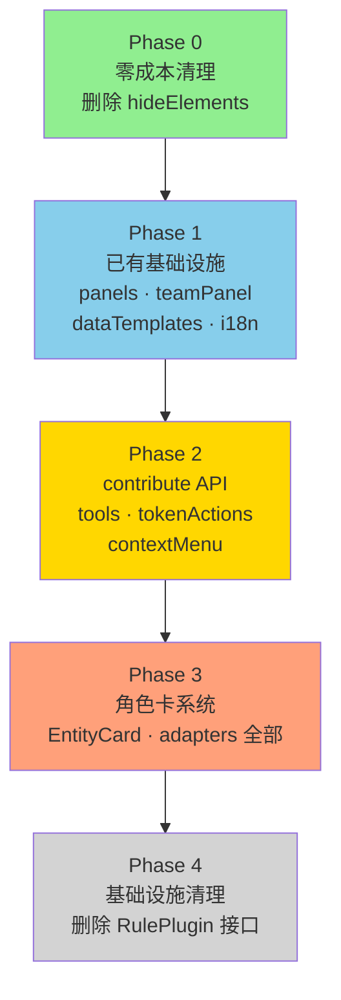

# 22 — RulePlugin 退役总框架

> **状态**：实施中 | 2026-04-05 更新
> **前置文档**：`17-插件系统演进路线.md`、`18-系统架构现状与演进分析.md`、`20-UI注册系统扩展方案.md`
> **偏差文档**：`docs/superpowers/deviations/2026-04-05-ruleplugin-phase0-2.md`
> **范围**：RulePlugin 接口的完整退役路径——消费点盘点、分阶段迁移方案、每阶段详细设计
>
> **PR #187 已完成的退役工作**：
>
> - ✅ `diceSystem` 层已完全删除 — DiceJudge OOP 类替代，judgment 由 DHActionCheckCard 自行渲染
> - ✅ `rollResultDeps.ts` 循环依赖桥已删除
> - ✅ `ctx.createEntity()` / `ctx.deleteEntity()` 已加入 WorkflowContext
> - ✅ `VTTPlugin.onReady(ctx)` 生命周期已实现 — FearManager 用它创建全局实体
> - ✅ `serverRoll` 简化为纯 RNG（返回 `number[][]`，不再创建 game_log）
> - ✅ 命名空间强制（`assertNamespaced()`）
> - ✅ `EntityLifecycle` 重设计为 `'persistent' | 'tactical' | 'scene'`
>
> **本 PR 已完成的退役工作**（偏差详见偏差文档）：
>
> - ✅ Phase 0：删除所有零消费接口属性（hideElements, dockTabs, gmTabs, keyBindings, getPresetTemplates）
> - ✅ Phase 1a（部分）：删除 `PluginPanelContainer.tsx`，DH `surfaces.panels` 移除。**偏差 D1**：FullCharacterSheet 未适配 IComponentSDK（成为死代码，待 Phase 3）
> - ✅ Phase 1d：i18n 迁移完成 — `usePluginTranslation()` 改为读 i18next namespace，`loadPluginI18n` 从 registry.ts 移除，DH 在 `onActivate` 中加载翻译
> - ✅ Phase 2：RendererRegistry 多注册扩展 — `getAllRenderers()` API、`multiSurfaces` Set（`entity`/`combat`）、单注册 surface 保持 warn+skip
> - ⏸️ Phase 1b：**偏差 D2** — TeamDashboard 未删除（需要 PanelRenderer 增强，issue #188）
> - ⏸️ Phase 1c：**偏差 D3** — 实体创建工作流化推迟（L 级工作量，需独立设计和 PR）
> - ⏸️ Phase 3/4：**偏差 D4** — 推迟到后续 PR

---

## 目录

1. [目标与原则](#1-目标与原则)
2. [当前消费点盘点](#2-当前消费点盘点)
3. [退役路线总览](#3-退役路线总览)
4. [Phase 0：零成本清理](#4-phase-0零成本清理)
5. [Phase 1：已有基础设施直接迁移](#5-phase-1已有基础设施直接迁移)
6. [Phase 2：需要 contribute API](#6-phase-2需要-contribute-api)
7. [Phase 3：角色卡系统迁移](#7-phase-3角色卡系统迁移)
8. [Phase 4：基础设施清理](#8-phase-4基础设施清理)
9. [与现有设计文档的对接](#9-与现有设计文档的对接)
10. [偏差追踪](#10-偏差追踪)

---

## 1 目标与原则

**目标**：将所有 RulePlugin 消费点迁移到 VTTPlugin + RendererRegistry + UIRegistry 模式，最终删除 RulePlugin 接口。

**原则**：

- **渐进式**：每个 Phase 独立交付、独立验证，不做大爆炸迁移
- **向后兼容**：迁移期间 RulePlugin 和新机制共存，旧代码渐进删除
- **复用现有设施**：优先使用 RendererRegistry（typed token）和 UIRegistry（registerComponent），不造新轮子
- **插件自治**：迁移后插件直读自己 namespace 的组件数据，不再通过 adapter 抽象层

---

## 2 当前消费点盘点

> 基于 commit `0a75ae4`（2026-04-04）的 grep 数据。

### 2.1 总览

| 层             | 生产文件数 | 调用点数 | 状态              |
| -------------- | ---------- | -------- | ----------------- |
| adapters       | 9          | 22       | 🔴 最重           |
| characterUI    | 2          | 2        | 🟠                |
| ~~diceSystem~~ | —          | —        | ✅ PR #187 已删除 |
| dataTemplates  | 2          | 2        | 🟡 待讨论         |
| surfaces       | 5          | 7        | 🟠                |
| i18n           | 2          | 间接     | 🟢                |
| hideElements   | 0          | 0        | ✅ 可删           |

### 2.2 adapters — 9 文件 22 次调用

| 方法                     | 文件:行                               | 用途               |
| ------------------------ | ------------------------------------- | ------------------ |
| `getMainResource()`      | `combat/KonvaToken.tsx:56`            | Token 上 HP 条渲染 |
|                          | `combat/TokenTooltip.tsx:16`          | Token 悬浮 HP 提示 |
| `getStatuses()`          | `combat/KonvaToken.tsx:60`            | Token 状态圆点     |
|                          | `combat/TokenTooltip.tsx:20`          | 悬浮状态提示       |
|                          | `layout/PortraitBar.tsx:278`          | 肖像状态指示       |
|                          | `layout/CharacterEditPanel.tsx:115`   | 角色编辑面板       |
|                          | `layout/CharacterDetailPanel.tsx:19`  | 角色详情面板       |
|                          | `layout/CharacterHoverPreview.tsx:45` | 肖像悬浮预览       |
| `getPortraitResources()` | `layout/PortraitBar.tsx:276`          | 肖像资源环         |
|                          | `layout/CharacterEditPanel.tsx:113`   | 角色编辑面板       |
|                          | `layout/CharacterDetailPanel.tsx:17`  | 角色详情面板       |
|                          | `layout/CharacterHoverPreview.tsx:42` | 肖像悬浮预览       |
| `getFormulaTokens()`     | `chat/ChatPanel.tsx:145`              | 聊天公式变量       |
|                          | `layout/CharacterEditPanel.tsx:114`   | 角色编辑面板       |
|                          | `layout/CharacterDetailPanel.tsx:18`  | 角色详情面板       |
|                          | `layout/CharacterHoverPreview.tsx:44` | 肖像悬浮预览       |
|                          | `stores/selectors.ts:57`              | 座位属性派生       |
|                          | `workflow/useWorkflowSDK.ts:113`      | Workflow 公式解析  |

### 2.3 characterUI — 2 文件 2 次调用

| 属性         | 文件:行                         | 用途           |
| ------------ | ------------------------------- | -------------- |
| `EntityCard` | `layout/PortraitBar.tsx:124`    | 展开角色卡     |
|              | `layout/MyCharacterCard.tsx:15` | 我的角色侧边卡 |

### ~~2.4 diceSystem~~ — ✅ 已在 PR #187 中完全退役

PR #187 删除了 `RulePlugin.diceSystem` 层。judgment 逻辑迁移到 `DiceJudge` OOP 类（`plugins/daggerheart-core/DiceJudge.ts`），由 `DHActionCheckCard` 在渲染时自行调用，不再通过 RulePlugin 接口。`rollResultDeps.ts` 循环依赖桥也已删除。

### 2.5 dataTemplates — 2 文件 2 次调用

| 方法                        | 文件:行                           | 用途                 |
| --------------------------- | --------------------------------- | -------------------- |
| `createDefaultEntityData()` | `dock/CharacterLibraryTab.tsx:47` | 创建新角色默认数据   |
|                             | `layout/PortraitBar.tsx:206`      | 快速创建角色默认数据 |

### 2.6 surfaces — 5 文件 7 次调用

| 属性                  | 文件:行                                   | 用途             |
| --------------------- | ----------------------------------------- | ---------------- |
| `panels`              | `layout/PluginPanelContainer.tsx:18`      | 插件浮动面板     |
| `teamPanel`           | `team/TeamDashboard.tsx:39`               | 团队仪表盘       |
| `tools`               | `combat/tools/registerBuiltinTools.ts:92` | 战术工具注册     |
| `getTokenActions`     | `combat/SelectionActionBar.tsx:35,55`     | Token 选中操作栏 |
| `getContextMenuItems` | `combat/TokenContextMenu.tsx:66,75`       | Token 右键菜单   |

### 2.7 基础设施文件（最后清理）

| 文件                                      | 角色                                                          |
| ----------------------------------------- | ------------------------------------------------------------- |
| `src/rules/types.ts`                      | RulePlugin 接口定义                                           |
| `src/rules/registry.ts`                   | 注册中心 + late-binding + i18n 加载                           |
| `src/rules/useRulePlugin.ts`              | React hook                                                    |
| `src/rules/sdk.ts`                        | SDK 导出（usePluginPanels, usePluginTranslation, rollResult） |
| ~~`src/log/renderers/rollResultDeps.ts`~~ | ~~循环依赖桥接~~ — ✅ PR #187 已删除                          |
| `plugins/daggerheart/index.ts`            | DH RulePlugin 实现                                            |
| `plugins/generic/index.ts`                | 通用 RulePlugin 实现                                          |
| `layout/HamburgerMenu.tsx:30`             | `getAvailablePlugins()` — 规则系统选择器                      |
| `admin/AdminPanel.tsx:15`                 | `getAvailablePlugins()` — 管理面板                            |
| `App.tsx:278`                             | `useRulePlugin()` — 初始化                                    |

---

## 3 退役路线总览



| Phase | 前置依赖                        | 工作量 | 涉及消费点                                                      | 状态                                          |
| ----- | ------------------------------- | ------ | --------------------------------------------------------------- | --------------------------------------------- |
| 0     | 无                              | 0      | hideElements, dockTabs, gmTabs, keyBindings, getPresetTemplates | ✅ 完成                                       |
| 1a    | 无                              | M      | panels (PluginPanelContainer)                                   | ✅ 完成（偏差 D1：FullCharacterSheet 未适配） |
| 1b    | PanelRenderer 增强 (issue #188) | S      | teamPanel (TeamDashboard)                                       | ⏸️ 阻塞                                       |
| 1c    | 独立设计                        | L      | dataTemplates, 实体创建路径精简 9→3                             | ⏸️ 推迟                                       |
| 1d    | 无                              | S      | i18n                                                            | ✅ 完成                                       |
| 2     | 无                              | M      | RendererRegistry 多注册 (tools, tokenActions, contextMenu)      | ✅ 完成                                       |
| 3     | Phase 2 完成                    | L-XL   | EntityCard, adapters 全部 (24 处)                               | ⏸️ 待开始                                     |
| 4     | Phase 0-3 全部完成              | S      | 基础设施删除                                                    | ⏸️ 待开始                                     |

> **注**：`diceSystem` 层已在 PR #187 中完成退役，不再列入路线。

---

## 4 Phase 0：零成本清理

**动作**：从 `src/rules/types.ts` 删除所有零消费的接口属性。

| 属性                 | 消费者 | 实现者 |
| -------------------- | ------ | ------ |
| `hideElements`       | 0      | 0      |
| `dockTabs`           | 0      | 0      |
| `gmTabs`             | 0      | 0      |
| `keyBindings`        | 0      | 0      |
| `getPresetTemplates` | 0      | 0      |

**涉及文件**：`src/rules/types.ts`、`src/rules/sdk.ts`（清理对应类型导出）

---

## 5 Phase 1：已有基础设施直接迁移

不需要新 API，使用已有的 `sdk.ui.registerComponent`、`sdk.defineWorkflow`、RendererRegistry。

### 1a. surfaces.panels → sdk.ui.registerComponent

**现状**：`PluginPanelContainer.tsx` 读取 `plugin.surfaces?.panels`，渲染浮动面板。当前 DH 注册了一个面板 `FullCharacterSheet`（`placement: 'fullscreen-overlay'`）。`PluginPanelContainer` 根据 `placement` 值选择渲染方式（全屏遮罩 vs 浮动居中），并向组件注入 `{ entity, onClose, onUpdateEntity, onCreateEntity }` props。

**迁移方案**：

- DH 插件在 `onActivate` 中调用 `sdk.ui.registerComponent({ id: 'dh-full-sheet', component: FullCharacterSheet, type: 'overlay', ... })`
- 面板通过已有的 `PanelRenderer`（UIRegistry 驱动）渲染，不再需要专用容器
- 已有先例：`core-ui` 插件已经使用这个模式（`plugins/core-ui/index.ts`）

**决策**：

1. **面板组件全部适配 IComponentSDK 新接口** — 旧 props（`entity, onClose, onUpdateEntity, onCreateEntity`）不再注入，面板组件改用 `sdk.data.useEntity()`、`sdk.ui.closePanel()` 等 SDK 方法自给自足
2. **删除 `PluginPanelContainer.tsx`** — `App.tsx` 已有 `PanelRenderer`（UIRegistry 驱动）和 `PluginPanelContainer`（RulePlugin 驱动）两套并行系统。DH 面板迁移后，`PluginPanelContainer` 零消费，直接删除
3. 原 `placement: 'fullscreen-overlay'` 映射为 `type: 'overlay'`

**涉及文件**：

- `plugins/daggerheart/index.ts`（或新建 daggerheart VTTPlugin）
- `plugins/daggerheart/ui/FullCharacterSheet.tsx`（适配 IComponentSDK props）
- `src/layout/PluginPanelContainer.tsx`（删除）
- `src/App.tsx`（删除 PluginPanelContainer 引用）

### 1b. surfaces.teamPanel → sdk.ui.registerComponent

**现状**：`TeamDashboard.tsx` 读取 `plugin.surfaces?.teamPanel`，向 `DHTeamPanel` 注入 `{ trackers, onUpdate, onCreate, onDelete }` props。

**迁移方案**：

- DH 插件注册 `sdk.ui.registerComponent({ id: 'dh-team-panel', component: DHTeamPanel, type: 'panel', ... })`
- `DHTeamPanel` 适配 IComponentSDK，用 SDK 方法自行读写 tracker 数据
- **删除 `TeamDashboard.tsx`** — 该容器仅是 RulePlugin teamPanel 的宿主。迁移后面板由 `PanelRenderer` 渲染，容器零消费，直接删除

**涉及文件**：

- `plugins/daggerheart/index.ts`（或新建 daggerheart VTTPlugin）
- `plugins/daggerheart/ui/DHTeamPanel.tsx`（适配 IComponentSDK props）
- `src/team/TeamDashboard.tsx`（删除）
- `src/App.tsx`（删除 TeamDashboard 引用）

### 1c. dataTemplates → 实体创建工作流化

**现状**：`CharacterLibraryTab.tsx:47` 和 `PortraitBar.tsx:206` 调用 `plugin.dataTemplates?.createDefaultEntityData()` 获取新角色默认组件数据（DH 的 hp/stress/attributes 全零初始值）。

**决策：实体创建统一工作流化**

经过分析，当前有 9 条实体创建/放置路径，逻辑分散在客户端 UI 和服务端 REST 中：

| #   | 入口                      | 当前实现                                        | 用了 dataTemplates? |
| --- | ------------------------- | ----------------------------------------------- | ------------------- |
| 1   | CharacterLibrary "+"      | 客户端构造 + REST POST                          | ✅                  |
| 2   | PortraitBar 创建角色      | 客户端构造 + REST POST                          | ✅                  |
| 3   | EntityPanel "+" NPC       | 客户端构造 + REST POST                          | ❌                  |
| 4   | KonvaMap 双击空白         | REST POST /tactical/tokens/quick                | ❌                  |
| 5   | spawnFromBlueprint        | REST POST（服务端查蓝图、构造、计编号）         | ❌                  |
| 6   | ctx.createEntity()        | Socket（workflow 内调用）                       | ❌                  |
| 7   | createEphemeralNpcInScene | 客户端乐观更新 + REST POST（与 #3 重复）        | ❌                  |
| 8   | placeEntityOnMap          | REST POST /tokens/from-entity（非创建，是放置） | ❌                  |
| 9   | duplicateToken            | 服务端复制 entity + token                       | ❌                  |

**决策：路径精简为 2 条核心创建路径 + 2 条保留路径**

| 核心创建路径     | 覆盖原路径             | 说明                                                                 |
| ---------------- | ---------------------- | -------------------------------------------------------------------- |
| **创建角色**     | #1 + #2 + #3 + #7 合并 | 统一的 `core:create-entity` workflow，参数区分 lifecycle/permissions |
| **从蓝图 spawn** | #5                     | 客户端读蓝图数据 → workflow 构造实体                                 |

| 处理    | 路径                         | 说明                                        |
| ------- | ---------------------------- | ------------------------------------------- |
| 🗑️ 删除 | #4 KonvaMap 双击创建 token   | 删除该功能                                  |
| 🗑️ 删除 | #7 createEphemeralNpcInScene | 与 #3 重复，合并到创建角色路径              |
| ✅ 保留 | #8 placeEntityOnMap          | 不是实体创建，是 token 放置，保留为独立 API |
| ✅ 保留 | #9 duplicateToken            | 保留当前服务端实现，暂不工作流化            |
| ✅ 底层 | #6 ctx.createEntity()        | 底层 API，上层路径最终调它                  |

**问题**：路径 5 的 `spawnFromBlueprint` 完全在服务端执行——查蓝图、复制组件、算编号名——但蓝图数据客户端已缓存在 `worldStore.blueprints`，服务端查询完全多余。

**方案**：定义 `core:create-entity` workflow，所有创建路径统一经过 workflow：

```
step 1: 准备数据（从蓝图/模板/用户输入构造 components）
step 2: ctx.createEntity({ id, components, lifecycle, permissions, blueprintId })
step 3: ctx.linkEntityToScene(sceneId, entityId)    ← 新 API（可选）
step 4: ctx.placeToken(entityId, x, y)              ← 新 API（可选）
```

DH 插件通过 `sdk.addStep` 在 step 1 之后注入默认组件——**dataTemplates 接口自然消亡**。

**需要扩展的基础设施**：

| 项                            | 说明                                                                                                            |
| ----------------------------- | --------------------------------------------------------------------------------------------------------------- |
| `ctx.createEntity` 增加参数   | 新增 `permissions?: EntityPermissions`、`blueprintId?: string`、`sceneId?: string`、`tokenPlacement?: { x, y }` |
| `spawnFromBlueprint` REST API | 删除 — 构造逻辑移到客户端 workflow                                                                              |
| `createToken` REST API        | 删除 — 统一用 createEntity + tokenPlacement                                                                     |

**决策：保持原子化接口**。不拆为 `createEntity` + `linkEntityToScene` + `placeToken` 三次请求。扩展 `entity:create-request` 接受可选的 `sceneId` 和 `tokenPlacement` 参数，服务端在同一个事务中完成实体创建 + 场景关联 + token 放置。避免中间断连产生孤儿实体。

**spawn 编号名重名问题**：编号名（"Goblin 3"）只写入 `core:identity.name`，不影响 id 唯一性。两个客户端同时 spawn 可能得到相同编号，**可接受**——用户可手动改名。

**涉及文件**：

- `src/workflow/types.ts`（扩展 createEntity 参数，新增 linkEntityToScene / placeToken）
- `src/workflow/context.ts`（实现新 API）
- `src/workflow/baseWorkflows.ts`（定义 core:create-entity workflow）
- `server/entitySocketHandler.ts`（扩展 entity:create-request 支持新参数）
- `server/routes/scenes.ts`（删除 /spawn endpoint）
- `server/routes/tactical.ts`（删除 /tokens/quick endpoint）
- `src/dock/CharacterLibraryTab.tsx`（改用 workflow）
- `src/layout/PortraitBar.tsx`（改用 workflow）
- `src/gm/EntityPanel.tsx`（改用 workflow）
- `src/combat/KonvaMap.tsx`（改用 workflow）
- `src/gm/GmDock.tsx`（改用 workflow）
- `plugins/daggerheart-core/index.ts`（addStep 注入默认组件）

### 1d. i18n → VTTPlugin.onActivate

**现状**：`registry.ts` 在注册 RulePlugin 时调用 `loadPluginI18n(plugin)` 加载翻译资源。`pluginI18n.ts` 的 `usePluginTranslation()` 依赖 `useRulePlugin().i18n`。

**迁移方案**：

- VTTPlugin 的 `onActivate` 中直接调用 i18next API 加载翻译资源
- `usePluginTranslation()` 改为接受 pluginId 参数，从 i18next 的 namespace 查找

**涉及文件**：

- `src/i18n/pluginI18n.ts`
- `src/rules/registry.ts`（删除 loadPluginI18n）

### ~~1e. diceSystem~~ — ✅ 已在 PR #187 中完成

diceSystem 层已完全退役：

- `RulePlugin.diceSystem` 属性已从接口删除
- `plugins/daggerheart/diceSystem.ts` 已删除
- `DiceJudge` OOP 类替代（`plugins/daggerheart-core/DiceJudge.ts`）
- `DHActionCheckCard` 在渲染时自行调用 `DiceJudge`
- `rollResultDeps.ts` 循环依赖桥已删除
- `RollResultRenderer` 不再访问 diceSystem，仅使用 dieConfigs 语义配置

---

## 6 Phase 2：列表注册模式

Token 操作、右键菜单、工具栏天然需要多项注册——即使同一个插件也会注册多个菜单项。

### 现状

DH 目前**未实现** `getTokenActions`、`getContextMenuItems`、`tools` 这三个 surfaces 属性（零实现）。基座消费方全有 null 保护，运行时返回空数组。但这些 slot 在架构上是必要的——未来插件需要往 token 右键菜单、选中操作栏、工具栏贡献内容。

### 基础设施变更：RendererRegistry 支持同 key 多次注册

当前 RendererRegistry 是 single-registration（`Map<string, T>`，重复注册 warn + 跳过）。需要扩展：

- 内部存储改为 `Map<string, T[]>`（同 key 多个值）
- 新增 `getAllRenderers(key): T[]` — 返回该 key 的所有注册值
- 现有 `getRenderer(key): T | undefined` 保持不变（返回第一个），向后兼容
- 注册顺序 = 插件调用顺序，不需要优先级数字

```typescript
// 插件注册（可多次）
sdk.ui.registerRenderer('combat', 'token-actions', { label: 'Action Check', ... })
sdk.ui.registerRenderer('combat', 'token-actions', { label: 'Rest', ... })

// 基座消费
const items = getAllRenderers('combat', 'token-actions')  // TokenAction[]
```

改动量：`src/log/rendererRegistry.ts` 内部 Map 从单值改为数组，加一个 `getAll` 方法。约 10 行。

### 2a. surfaces.tools

**迁移**：DH 插件在 `onActivate` 中多次 `sdk.ui.registerRenderer('combat', 'tool', toolDef)`。`registerBuiltinTools.ts` 改为从 RendererRegistry `getAllRenderers` 读取。

**涉及文件**：`src/combat/tools/registerBuiltinTools.ts`

### 2b. surfaces.getTokenActions

**迁移**：DH 插件注册 token action items。`SelectionActionBar.tsx` 从 RendererRegistry 读取。

**涉及文件**：`src/combat/SelectionActionBar.tsx`

### 2c. surfaces.getContextMenuItems

**迁移**：DH 插件注册 context menu items。`TokenContextMenu.tsx` 从 RendererRegistry 读取。

**涉及文件**：`src/combat/TokenContextMenu.tsx`

### 动态过滤

当前 `getTokenActions(ctx)` 和 `getContextMenuItems(ctx)` 是函数——接收 context 参数可以动态决定显示哪些项。改为静态注册后，过滤逻辑（如 GM-only）由基座消费端处理（`TokenContextMenu.tsx` 已有 `item.gmOnly` 过滤）。如果需要更复杂的动态逻辑（比如根据选中 token 类型决定），注册值可以是 `{ ...item, when?: (ctx) => boolean }` 带条件函数。

---

## 7 Phase 3：角色卡系统迁移

最大的迁移块，涉及 24 个消费点。核心思路：**消除 adapter 翻译层，用声明式数据绑定替代。**

### 设计原则

参考 FVTT 模型：基座提供通用 UI 概念（resource bar、status dot），插件只声明数据绑定——"我的哪个组件在哪个位置以什么样式展示"。基座负责渲染，保证所有 game system 的视觉体验一致（如 bar 可拖动、统一动画等）。

### 3 个通用概念 + 1 个组件 slot

用 `registerRenderer` + Phase 2 的多注册扩展（`getAllRenderers`）统一注册，不需要新 API。

#### 概念 1：Bar（资源条）

替代 `getMainResource` + `getPortraitResources`。

```typescript
// DH 插件 onActivate
sdk.ui.registerRenderer('entity', 'bar', {
  componentKey: 'daggerheart:health',
  label: 'HP',
  color: '#ef4444',
})
sdk.ui.registerRenderer('entity', 'bar', {
  componentKey: 'daggerheart:stress',
  label: 'Stress',
  color: '#f97316',
})
```

基座约定：被注册的组件数据必须是 `{ current: number, max: number }` 形状。基座各 UI 位置各自决定如何渲染 bar：

| UI 位置        | 渲染方式            |
| -------------- | ------------------- |
| KonvaToken     | Canvas 上画条状 bar |
| PortraitBar    | 环形进度条          |
| TokenTooltip   | 文字 "HP 8/12"      |
| CharacterPanel | 可编辑数值          |

**一份注册，多处消费。**

如果未来某个插件需要完全自定义 bar 渲染（类似 FVTT 的 Bar Brawl），可以注册 `('entity', 'bar-custom')` 组件覆盖基座默认渲染。两级 fallback：自定义组件 → 数据驱动通用渲染。

#### 概念 2：Status（状态标记）

替代 `getStatuses`。DH 目前返回空数组，但 D&D 等系统会大量使用（中毒、昏迷、祝福等）。

```typescript
sdk.ui.registerRenderer('entity', 'status', {
  componentKey: 'daggerheart:conditions',
  extract: (data) => StatusView[],  // 如果组件形状不是标准格式
})
```

#### 概念 3：FormulaBinding（公式变量绑定）

替代 `getFormulaTokens`。用于 `@agility → 3` 的公式解析。

```typescript
sdk.ui.registerRenderer('entity', 'formula-binding', {
  componentKey: 'daggerheart:attributes',
  extract: (data) => ({ agility: data.agility, strength: data.strength, ... }),
})
```

消费者：ChatPanel（聊天 @变量自动补全）、selectors.ts（座位属性派生）、useWorkflowSDK（workflow 公式解析）。

#### 组件 slot：EntityCard

替代 `characterUI.EntityCard`。这是完整的 UI 组件，不是数据声明。

```typescript
sdk.ui.registerRenderer('portrait', 'entity-card', DaggerHeartCard)
```

基座从 RendererRegistry 查找，fallback 到通用卡片。PortraitBar 和 MyCharacterCard 改为从 RendererRegistry 读取组件。

### 注册顺序 = 显示顺序

同一个概念注册多次时（多个 bar），按注册顺序显示。不需要优先级数字——当前只有一个插件，YAGNI。

### KonvaToken 限制

Token 在 react-konva Canvas 里，通用 bar/status 渲染需要用 Konva 的 `<Rect>` / `<Text>` 实现，不是 DOM。但这是基座内部实现细节，对插件透明——插件只声明数据绑定，不关心渲染技术。

### 消费点迁移映射

| 原 adapter 方法        | 新概念         | 消费文件                                                     |
| ---------------------- | -------------- | ------------------------------------------------------------ |
| `getMainResource`      | Bar            | KonvaToken, TokenTooltip                                     |
| `getPortraitResources` | Bar            | PortraitBar, CharEdit/Detail/Hover                           |
| `getStatuses`          | Status         | KonvaToken, TokenTooltip, PortraitBar, CharEdit/Detail/Hover |
| `getFormulaTokens`     | FormulaBinding | ChatPanel, selectors, useWorkflowSDK, CharEdit/Detail/Hover  |
| `EntityCard`           | 组件 slot      | PortraitBar, MyCharacterCard                                 |

### 涉及文件

### CharacterEditPanel 迁移

`CharacterEditPanel.tsx` 同时读 adapter 数据（显示）和直接写 `rule:resources`/`rule:attributes`/`rule:statuses` 硬编码 key（编辑）。它只被 `GenericEntityCard` 使用——只在 generic 模式下出现。

**决策**：`CharacterEditPanel.tsx` 和 `CharacterHoverPreview.tsx` 整体迁入 `plugins/generic/` 目录，成为 generic 插件的内部组件。两者都直接读写 `rule:resources`/`rule:attributes`/`rule:statuses` 硬编码 key。迁入后 `rule:` 前缀统一改为 `generic:`，与 generic 插件的 Bar/Status/FormulaBinding 注册 key 一致。

### 类型安全

为每个 slot 定义 typed `RendererPoint<T>` 常量，从 `@myvtt/sdk` 导出：

```typescript
export const BAR_POINT = createRendererPoint<BarRegistration>('entity', 'bar')
export const STATUS_POINT = createRendererPoint<StatusRegistration>('entity', 'status')
export const FORMULA_POINT = createRendererPoint<FormulaRegistration>('entity', 'formula-binding')
export const ENTITY_CARD_POINT = createRendererPoint<React.ComponentType<EntityCardProps>>(
  'portrait',
  'entity-card',
)
```

注册和消费都使用 typed token，保证编译期类型安全，避免 RendererRegistry 成为 untyped bag。

### 涉及文件

**插件侧**（注册声明）：

- `plugins/daggerheart-core/index.ts`（或新 VTTPlugin，注册 Bar/Status/FormulaBinding）
- `plugins/daggerheart/DaggerHeartCard.tsx`（保留，改为 RendererRegistry 注册；修复 SDK 边界违规：`getWorkflowEngine` 直接 import）
- `plugins/daggerheart/adapters.ts`（删除）
- `plugins/generic/CharacterEditPanel.tsx`（从 `src/layout/` 迁入，`rule:` key → `generic:` key）
- `plugins/generic/CharacterHoverPreview.tsx`（从 `src/layout/` 迁入，`rule:` key → `generic:` key）

**基座侧**（消费改造）：

- `src/combat/KonvaToken.tsx` — 从 RendererRegistry 读 Bar/Status
- `src/combat/TokenTooltip.tsx` — 同上
- `src/layout/PortraitBar.tsx` — 从 RendererRegistry 读 Bar/Status/EntityCard
- `src/layout/MyCharacterCard.tsx` — 从 RendererRegistry 读 EntityCard
- `src/layout/CharacterDetailPanel.tsx` — 从 RendererRegistry 读 Bar/Status/FormulaBinding
- `src/chat/ChatPanel.tsx` — 从 RendererRegistry 读 FormulaBinding
- `src/stores/selectors.ts` — 同上
- `src/workflow/useWorkflowSDK.ts` — 同上（同时删除 `_bindRuleRegistry` 循环依赖 hack）
- `src/data/dataReader.ts` — `formulaTokens` stub 接入 RendererRegistry

---

## 8 Phase 4：基础设施清理

所有消费点归零后执行。

| 动作                              | 文件                                                                                             |
| --------------------------------- | ------------------------------------------------------------------------------------------------ |
| 删除 RulePlugin 接口              | `src/rules/types.ts`                                                                             |
| 删除注册中心                      | `src/rules/registry.ts`                                                                          |
| 删除 hook                         | `src/rules/useRulePlugin.ts`                                                                     |
| 删除 SDK 导出                     | `src/rules/sdk.ts`（部分保留、部分删除）                                                         |
| 重写 DH 插件                      | `plugins/daggerheart/index.ts` → VTTPlugin（adapters/characterUI/surfaces/dataTemplates 迁出后） |
| 重写通用插件                      | `plugins/generic/index.ts` → VTTPlugin（注册 Bar/Status/FormulaBinding）                         |
| 迁移规则选择器                    | `layout/HamburgerMenu.tsx`、`admin/AdminPanel.tsx` → 插件管理器                                  |
| 清理 App 初始化                   | `App.tsx` — 删除 useRulePlugin 引用                                                              |
| 删除 `usePluginPanels`            | `src/rules/usePluginPanels.ts` — Phase 1a 删除 PluginPanelContainer 后同步删除                   |
| 删除 `_bindRuleRegistry` 循环依赖 | `src/workflow/useWorkflowSDK.ts` — FormulaBinding 改为 RendererRegistry 后，循环依赖链消失       |
| 修复 `dataReader.ts` stub         | `src/data/dataReader.ts` — `formulaTokens` 需接入 RendererRegistry                               |

> **已在 PR #187 中清理的项**：`rollResultDeps.ts`（已删除）、`diceSystem.ts`（已删除）

### 架构决策

**Generic 插件 fallback**：不需要基座内建 fallback。没有插件 = 没有 bar/status，这是正确的行为。`generic` 作为一个普通 VTTPlugin 存在，按需加载，与 DH 插件完全平等，没有特权。

**插件管理模型**：

- 当前 `ruleSystemId`（单一规则系统选择）→ 未来变成 `loadedPlugins: string[]`（房间加载的插件列表）
- VTTPlugin 接口增加 `name` 字段（插件管理器显示名称）
- HamburgerMenu / AdminPanel 的规则选择器 → 未来变成插件管理器 UI
- 所有插件完全平等，无特权插件概念
- 插件管理器是独立功能，不阻塞 RulePlugin 退役

---

## 9 与现有设计文档的对接

| 本文档 Phase              | 对接文档                             | 关系                                                    |
| ------------------------- | ------------------------------------ | ------------------------------------------------------- |
| ~~Phase 1e (diceSystem)~~ | —                                    | ✅ PR #187 已完成                                       |
| Phase 2 (contribute)      | doc 20 §一 RendererRegistry 模式     | doc 20 已确认 context-menu/tooltip 用 RendererRegistry  |
| Phase 3a (EntityCard)     | doc 20 §一「不需要新基础设施的需求」 | `registerRenderer('portrait-slot', type, component)`    |
| Phase 3b-e (adapters)     | doc 17 §4 终态架构                   | "插件直接读自己的组件"                                  |
| Phase 2 contribute 扩展   | doc 20                               | 需新增 `registerContributor`/`getContributors` 列表模式 |

### PR #187 新增的基础设施（可在后续 Phase 中利用）

| 能力                                              | 说明                                        |
| ------------------------------------------------- | ------------------------------------------- |
| `ctx.createEntity({ id, components, lifecycle })` | 插件可创建 well-known 全局实体              |
| `ctx.deleteEntity(entityId)`                      | 插件可删除实体                              |
| `VTTPlugin.onReady(ctx)`                          | 插件初始化生命周期，可执行 store 依赖的操作 |
| `assertNamespaced(pluginId, key)`                 | 强制插件 key 带命名空间前缀                 |
| `getChatVisibleTypes()`                           | 动态获取已注册 chat 渲染器的 entry types    |

---

## 10 偏差追踪

> 详细偏差文档：`docs/superpowers/deviations/2026-04-05-ruleplugin-phase0-2.md`

| #   | 设计 vs 实现                                        | 状态                 | 原因                                                           |
| --- | --------------------------------------------------- | -------------------- | -------------------------------------------------------------- |
| D1  | Phase 1a：FullCharacterSheet 未适配 IComponentSDK   | ⏸️ 推迟到 Phase 3    | 466 行，需设计 overlay panel 如何通过 SDK 获取 entityId 上下文 |
| D2  | Phase 1b：TeamDashboard 未删除                      | ⏸️ 阻塞于 issue #188 | PanelRenderer 不支持固定定位 + 可折叠模式                      |
| D3  | Phase 1c：实体创建工作流化推迟                      | ⏸️ 需独立 PR         | L 级工作量，涉及 5+ UI 文件 + 2 服务端 endpoint 删除           |
| D4  | Phase 3/4 推迟                                      | ⏸️ 需后续 PR         | L-XL 级工作量                                                  |
| D5  | `usePluginPanels` hook 成为死代码                   | ⏸️ 随 Phase 3 清理   | DaggerHeartCard 仍调用 openPanel，但运行时无效                 |
| D6  | Phase 2 实现细节：`multiSurfaces` Set 区分单/多注册 | ✅ 接受              | 设计未明确规定，实现引入 `entity`/`combat` 为多注册 surface    |
